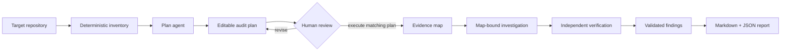

# Audit

Audit is a read-only agentic code review workflow for finding and explaining security weaknesses in source code. It reads a repository plus optional per-use-case Markdown context about surrounding systems, deployment, data, and controls. It first creates an editable audit plan, then executes the supplied matching plan and emits accepted source-backed findings. Classification, urgency, and remediation are deliberately separate from proof.

It is a defensive code review tool—not a hacker tool: it does not probe running systems, execute exploits, make target network calls, execute target code, or mutate the reviewed repository.

The reviewer is implemented with TypeScript and Bun, but its target scope is language-agnostic: every eligible regular UTF-8 source file can be evidence, whatever its language or extension. Language detection is optional metadata, never an allowlist.

## Contents

- [Quick setup](#quick-setup)
- [Workflow](#workflow)
- [Safety boundary](#safety-boundary)
- [Evaluation](#evaluation)
- [Repository map](#repository-map)
- [Documentation](#documentation)
- [Status](#status)

## Quick setup

Requirements: Bun >=1.3.14 and an optional Purista-supported model provider.

```bash
bun install
cp .env.example .env
# Edit .env: set OPENAI_API_KEY. OpenAI / gpt-5.6-terra is the default route.
bun run check
```

To use a published release instead of a repository checkout:

```bash
bunx @sebastianwessel/audit --help
```

Audit is released under the [Apache-2.0 license](./LICENSE).

After completing `.env`, create a plan, review its Markdown projection, optionally create/reseal an editable draft, then audit the sealed JSON:

```bash
bun run start plan --target ./target
bun run start plan-draft --plan plans/<plan-id>.json --draft plan-drafts/review.json
# Edit the draft's vectors, then create a new plan pair.
bun run start plan-reseal --plan plans/<plan-id>.json --draft plan-drafts/review.json
bun run start audit --target ./target --plan plans/<plan-id>.json
```

`plans/<plan-id>.json` is the only executable plan. Its matching Markdown file is a human review projection; YAML and Markdown are not executable plan inputs.

Add `--context ./security-context` to `plan` and `audit` when optional Markdown context is available. Plans, snapshots, checkpoints, and developer guidance remain under private work. Each audit writes source-minimal JSON and Markdown reports below the public artifact root’s `reports/` directory; upload only that public root in CI. The `report` command re-renders a stored public JSON report without calling a model.

The local `.env` needs only `OPENAI_API_KEY` for the default OpenAI / `gpt-5.6-terra` route. It can optionally override the provider/model, credential name, runtime limits, separate private-work/public-artifact directories, and evaluation paths. CLI arguments select the audit or evaluation run but never override those runtime settings. Never commit `.env` or upload private work.

After an audit, optionally create developer guidance for the accepted findings:

```bash
bun run start guidance --target ./target --plan plans/<plan-id>.json --report reports/<report-id>.json
```

Guidance is a separate, non-gating artifact. It records advisory priority and a deterministic next action, but it never changes the audit result, stores model-authored advice, or proves exploitability.

To compare two reports without calling a model or rereading the target:

```bash
bun run start lineage --previous reports/report-previous.json --current reports/report-current.json
```

## Workflow



## Safety boundary

Version 1 is static and defensive. It reads only explicitly scoped source files, does not execute target code, does not mutate the target, and never lets target-analysis tools use the network. A configured model provider is the only optional external connection. Findings are triage candidates requiring human review; they are not proof of exploitability.

## Evaluation

Run the offline mixed-language corpus without credentials or target execution:

```bash
bun run eval:corpus:integration
```

It validates pinned JavaScript, Java, and C source cases; keeps answer keys and evaluator-authored audit plans outside the agent jail; runs the normal plan/audit flow with a deterministic provider; and writes integration artifacts under `evaluation/runs/`. It proves evaluator wiring and safety, not detection quality. Set `OPENAI_API_KEY` in `.env`, then use `bun run eval:provider` for one diagnostic provider run. The default route is OpenAI / gpt-5.6-terra; uncomment the optional route settings only to use another provider or model. Choose and record the repeat count that fits the question; the product imposes no repeat threshold. Add `--plan-profile audit-reviewed-plan` to measure audit quality against an evaluator-authored plan without a provider planning call. Use `--plan-profile planning-generated` to measure planning alone, or retain the default `end-to-end-generated` to measure both steps. Use `bun run eval:corpus:readiness` to see whether the local corpus can support a quality claim.

## Repository map

| Area | Purpose |
| --- | --- |
| [docs/](./docs/) | Human-focused explanation from beginner to expert |
| [src/features/](./src/features/) | Capability-owned Zod schemas, logic, orchestration, and side-by-side unit tests |
| [evaluation/src/](./evaluation/src/) | Evaluator-only schemas, orchestration, and side-by-side unit tests |
| [src/platform/](./src/platform/) | Filesystem, provider, configuration, and artifact adapters |
| [src/shared/](./src/shared/) | Strictly limited cross-feature primitives |

## Documentation

Start with [the overview](./docs/01-overview/README.md), then follow the [getting-started guide](./docs/02-getting-started/README.md). Architecture and security details are in [the expert track](./docs/05-expert/README.md).

## Status

The local workflow is ready for trials: source inventory, strict context parsing, a read-only Purista harness, editable plan execution, report rendering, and an isolated mixed-language evaluation corpus are implemented. Provider-quality or reliability claims remain gated on a larger, independently human-reviewed real-world corpus and an unseen private holdout.
