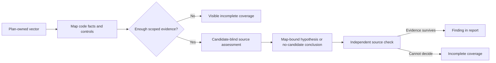

# Evidence-first review

Audit does not ask a model to jump straight from “look for injection” to “this line is vulnerable.” It uses a short evidence-first sequence inside every plan-owned review vector. The executable plan also names the exact review obligations: each combines a risk statement with the source-backed evidence required to investigate it. This prevents the audit from silently inventing extra work—or silently dropping planned work.

The first pass records neutral facts from the plan-owned file scope: inputs, boundaries, operations, outputs, and source-local controls such as validation or authorization. For every review question, it explicitly lists the controls it observed—even if the reviewer later decides they are insufficient. That makes a missing safeguard visible as incomplete review work instead of silently letting later steps overlook it. The model selects only an inspected file and line; Audit retains a source-minimal reference (location, role, kind, and content digest), never an excerpt. It can also say which review questions could not be answered.

A separate, fresh source-assessment pass then evaluates each approved risk-positive obligation from that neutral map and the same scoped source area. It does not receive proposed findings, classification, urgency, remediation, prior verdicts, test answers, or paired vulnerable/patched information. Its answer can be **risk-supported**, **risk-contradicted**, or **inconclusive**. This makes the reviewer form an evidence posture before it sees a possible issue to argue for.

Only then may the reviewer suggest a security concern. That suggestion must refer back to the recorded facts, the source assessment for each relevant review question, and fresh, in-scope source evidence. Before it becomes a finding, the source assessment and verifier both actively challenge the concern against every recorded control. The assessment is useful context, not an automatic yes/no gate. The suggestion explicitly connects a relevant input, asset, or boundary to the operation or output being reviewed, so one concern cannot be supported by unrelated facts from the same code area. A separate verification pass checks that connection, looks for counter-evidence, and must account for every relevant control recorded in the map before it can retain a finding.

Every phase that makes a source decision must use the scoped read-only file tools. A phase that returns without doing so gets one retry in the same plan-owned scope; if it still does not inspect source, the review records incomplete coverage rather than trusting an uninspected conclusion.

Where the source makes it clear, the reviewer also records the relevant entrypoint, the true effecting operation, the location where a control is enforced, and counter-evidence that challenges the concern. These labels make a finding easier to review; they are not a substitute for evidence. A library function or a small plan-owned source fragment may have no meaningful entrypoint, and the reviewer records that uncertainty rather than making one up.

Sometimes a reviewer has the right concern but cites the wrong internal reference or omits a required link in the evidence trail. In that case, Audit gets one tightly limited correction pass. It can re-check the same plan-owned files and align references to the existing evidence map; it cannot invent a new concern, add classification or urgency, inspect more files, or turn a rejected concern into a finding by itself. The normal verification step still decides whether the corrected concern is supported.

At the end, the report shows one closure row for every planned obligation. A row can lead to a retained finding, a candidate that did not survive verification, or a model conclusion that no source-backed candidate was found. The last of these is **not** a statement that the code is safe. Missing evidence, a missing phase, or an unclosed obligation is shown as incomplete coverage and stops the vector from being marked complete.

This is still static analysis. A reported finding is evidence for human triage, not proof that an exploit works in a live system. If the available files cannot establish a conclusion, the report says so instead of silently treating the vector as safe.
