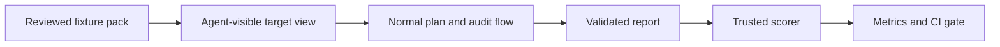

# Evaluation

Security Reviewer is evaluated as a complete system: the plan gate, scoped read-only tools, agent loop, evidence validation, deduplication, and report. Model quality and product safety are measured separately.

Start with [fixture authoring](./fixture-authoring.md), then learn about the [offline real-world corpus](./real-world-corpus.md), [human adjudication](./human-adjudication.md), [source acquisition](./source-acquisition.md), the [multilingual real-world acquisition track](./real-world-acquisition.md), and [benchmarking](./benchmarking.md).
