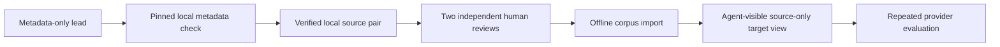

# Real-world acquisition

The reviewer needs real code to measure whether it is useful. It must acquire that code carefully: a benchmark record is a lead, not a finding and not an instruction for the model.

## What the acquisition track does

`bun run eval:acquisition` validates an evaluator-only roadmap for building a multilingual real-world corpus. It currently tracks these lanes:

| Lane | Languages | Current state |
| --- | --- | --- |
| OpenSSF CVE Benchmark | JavaScript, TypeScript | 30 metadata-only leads; one unreviewed JavaScript source pair acquired |
| CWE-Bench-Java | Java | 12 metadata-only leads; one unreviewed Java source pair acquired |
| OSV API pinned advisory | Python | One metadata-only Git-range lead; one unreviewed Python source pair acquired |
| OSV API pinned advisory | Go | One metadata-only Git-range lead; one unreviewed Go source pair acquired |
| CVEfixes | C, C++, Go, Java, JavaScript, PHP, Python | Metadata unavailable at the pinned repository revision; no local candidates. |
| DiverseVul | C, C++ | Metadata unavailable at the pinned repository revision; no local candidates. |

The command is local and read-only. It does not download repositories, invoke a benchmark's scripts, copy target source, call a model, or create an evaluation case. It also reports a source lane as **metadata unavailable** with one checked reason when its pinned source does not provide a complete locally verifiable record set; that is an evidence gap, not an invitation to infer candidate revisions.

## From a lead to a measured case

At every step, material stays in the evaluator domain until it is safe to move forward.

- Candidate metadata never becomes a model prompt, an answer key, or a security rule.
- A metadata lead owns only its pinned upstream record and observed source-license status. A local source pair is the sole record that a snapshot was acquired; it remains unlabelled and never becomes model input until a separately reviewed corpus case is imported.
- The reviewer reads only one selected source variant at a time; it cannot access answer keys, paired patches, reviewer notes, or acquisition records.
- A case counts toward reliability only after two distinct human reviewers agree on the source-visible expected finding and the patched expectation. Those records live only with the completed evaluation case; the lead tracker and source pair never duplicate them.
- No target code, build, test, exploit, container, or network request is ever run by the reviewer.

## Current interpretation

The 44 OpenSSF, CWE-Bench-Java, and OSV entries are useful acquisition progress, not 44 evaluation cases. One pair from each ready registry has a byte-verified local source snapshot; all other leads remain metadata-only. None of the four acquired pairs has a human review, answer key, or readiness contribution. The lanes make the language mix explicit so future measurements do not silently become JavaScript-only.

Use `bun run eval:corpus:readiness` after importing reviewed cases. It reports the remaining evidence gaps separately from the audit's precision and recall.

When a provider evaluation is explicitly resumed after an incomplete run, the evaluator reuses a matching generated plan before it resumes the audit. It checks the run configuration and the selected source/context fingerprints first, so a changed target never reuses a plan from an earlier version.
