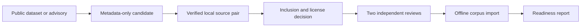

# Choosing real-world source leads

The checked-in corpus is intentionally too small to measure provider reliability. This guide explains how to find better source leads without turning a public dataset label into “ground truth.”

## The short version

Use a dataset only to discover a candidate vulnerable/fixed pair. First acquire and verify complete, pinned local source snapshots. Then decide whether the source can be included, and independently establish what a static review can support. Two human reviewers create the answer key independently. Only then can the offline importer add the case to the corpus.



## Useful source leads

| Lead source | Best use | Important limitation |
| --- | --- | --- |
| [OpenSSF CVE Benchmark](https://github.com/ossf-cve-benchmark/ossf-cve-benchmark) | JavaScript vulnerable/fixed revision leads with pinned metadata. | It is not enough by itself for a mixed-language corpus. |
| [OSV](https://google.github.io/osv.dev/data/) | Advisory metadata that can supply an exact repository Git revision pair when its pinned local record has adjacent `introduced` and `fixed` events. | The advisory is provenance only. It does not establish a source-level finding, category, or answer key. |
| [CVEfixes](https://arxiv.org/abs/2107.08760) | A broad, multi-project discovery reservoir: its published collection includes fix-commit and programming-language metadata. | Treat its records as leads; the pinned tooling repository alone is not the dataset, so first obtain a separately immutable local metadata distribution. Then verify each upstream project’s source license and revisions locally. |
| [PrimeVul](https://github.com/DLVulDet/PrimeVul) | C/C++ discovery leads with commit and file metadata. | It is function-oriented research data, so reconstruct and review the relevant project-level source snapshot before use. |
| [OWASP Benchmark](https://owasp.org/www-project-benchmark/) and [NIST Juliet](https://samate.nist.gov/SARD/documentation) | Controlled synthetic regressions for safety and known weakness shapes. | They do not count as real-world provider-reliability evidence. |

Do not use dynamic-exploitation benchmarks for this tool’s core measurement. The reviewer never runs target code, probes a deployed service, delivers payloads, or treats exploit success as a requirement.

## Build a balanced queue

Start with repository-distinct pairs, not a large number of patches from one popular project. Keep the development queue balanced across the control families used by the readiness report, and deliberately include at least three language families before making a reliability claim.

The current OpenSSF, CWE-Bench-Java, and OSV registries provide 44 metadata leads. Four vulnerable/patched source pairs—one Go, one Java, one JavaScript, and one Python—have also been acquired from already-local repositories and byte-verified. None has review records, an inclusion decision, an answer key, or readiness weight. The queue still needs complementary C/C++ and multi-language sources. Assign each repository to development, test, or private holdout before reviewers write an answer key.

## Acquire a local source pair

When a candidate's Git objects are already available locally, use the acquisition command to create an immutable curation workspace:

```bash
bun run eval:acquire -- \
  --registry evaluation/candidates/cwe-bench-java-candidate-pilot.json \
  --candidate cwe-bench-java-cve-2016-9177 \
  --repository /path/to/already-local/repository \
  --output evaluation/acquisition-snapshots
```

The command reads only the named local Git object store. It confirms both pinned revisions, copies every tracked regular file in each variant, verifies file modes and byte digests, and writes the pair plus a manifest atomically. It rejects unsafe paths, symlinks, submodules, missing revisions, and later tampering. It does not fetch from a network, execute a build or test, infer a vulnerability, create labels, or expose the pair to a model.

The acquired pairs are the Spark Java source pair `source-pair-f2d690530afa8fe5` (187 vulnerable files, 186 patched files; digest `8334e8bc1fe5dc1a25748d188273f9c4f2183888dd12000401bc4f78ad63e9d3`), the decamelize JavaScript pair `source-pair-e7f2be359ec3b494` (9 vulnerable files, 9 patched files; digest `29d188fae1ee685be696ff11b47a82c66cde08164aef172a32db8090a503c5f1`), the urllib3 Python pair `source-pair-2be21bd89c0aa2b3` (151 vulnerable files, 148 patched files; digest `406d6844891ee3cd082f7dd87fbc2b0cb1b157b41a63881c65565ff930e76a25`), and the go-git Go pair `source-pair-b04707ed51b422f0` (387 vulnerable files, 476 patched files; digest `37144fe74d4f4de5aa795a1451ed66be1ea243dcc2ad5cd1d61d844e8717922d`). Their recorded source-license status is still `unverified`; acquisition is not an inclusion decision.

## What to record for every candidate

- Dataset or advisory source, immutable revision, and the exact metadata digest.
- Upstream repository URL plus vulnerable and patched revisions.
- Source license and redistribution decision before corpus inclusion.
- Snapshot checksums, retrieval date, attribution, and project-level split.
- Two independent, source-only human reviews; preserve disagreements rather than editing them away.

The candidate validator, source-pair acquisition command, and corpus importer work only with already-local data. They never fetch source, run a target, or create an answer key.

## When a measurement can mean something

A provider run records two separate facts:

- The workflow finding gate tells you whether that recorded run met its declared safety and finding criteria.
- The evidence qualification tells you whether the selected split and independently reviewed corpus are large enough for a diagnostic, development-pilot, or private-holdout interpretation. The private interpretation also needs a source-free detached signature from the holdout steward, bound to the exact isolated pack and frozen readiness decision.

Until the readiness report shows independently reviewed real-world pairs and a private holdout, results are diagnostic. Use them to find workflow weaknesses, not to claim that a model is reliable.
