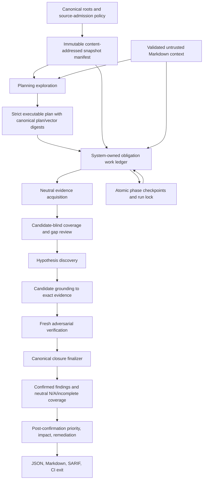

# Security Reviewer production-readiness audit

- **Priority:** P0 release decision
- **Effort:** XL program; execute as five waves
- **Risk:** High if shipped before P0 closure
- **Status:** Proposed from read-only review
- **Reviewed:** 2026-08-02, uncommitted workspace snapshot

## Overview

Security Reviewer is intended to be a defensive, language-neutral source audit system:

1. The planner reads an explicitly admitted repository snapshot plus optional untrusted Markdown/frontmatter context and creates an executable audit plan.
2. A person may review or edit that plan outside the product. Executing the supplied matching plan is the only approval signal; the product owns no approval workflow or reviewer metadata.
3. The audit executes every enabled plan obligation against static source/context only. It never runs target code, attacks a live system, mutates the target, or gives the model shell/network access.
4. Every obligation closes as a confirmed source-backed finding, verified rejection/no candidate, neutral source-backed `not-applicable`, or explicit incomplete state. `not-applicable` is not a pass. Incomplete coverage must fail CI separately from findings.
5. Only after confirmation should an enterprise reporting layer add priority, impact, and a feasible proposed remediation. Those fields must never influence whether a finding is admitted.

That product direction is valuable and differentiated: an editable AI-generated plan separates threat-aware planning from execution, while source-backed verification and neutral applicability provide a usable enterprise audit contract. The implementation already contains good foundations—strict Zod contracts, scoped read-only tools, candidate-blind analysis, fresh verification sessions, provider-neutral context error detection, centralized token/cost observations, and answer-key isolation.

The current implementation is nevertheless **not production ready**. The main problem is structural, not model choice. Several paths can declare success without complete evidence, reuse results for an edited plan, lose reached state after a late failure, count a rejected tool call as source inspection, or hit a hidden 64-step Harness ceiling. Current evaluation numbers do not measure the semantic plan/finding accuracy the product needs.

## Current evidence

| Signal | Observed value | Interpretation |
| --- | ---: | --- |
| Unit tests | 291 passing in the last full workspace check | Useful regression base, but at least one test explicitly locks the incorrect incomplete-audit exit code to success. |
| Coverage | 84.35% lines; 90.68% functions | Broad coverage does not cover key recovered reducers, finding-bearing Markdown, or cross-field artifact invariants. |
| Corpus readiness | 4 cases; 1 real-world; 2 paired; 0 dual-reviewed qualifying pairs; 0/6 qualifying control families | No defensible production accuracy claim is possible. |
| Reviewed-plan provider run | 10/10 trials completed; median/minimum known-range recall 0; finding Jaccard 0.25; 100 calls; $0.539349 | Diagnostic evidence that the current workflow misses the labelled location and is unstable. The scorer cannot tell whether unmatched outputs are valid alternatives. |
| Planning-only provider run | 30/30 trials completed; path coverage reported as complete; plan Jaccard 0.95; 63 calls; $0.341452 | This measures scope-glob reachability, not whether the AI generated the expected audit scenarios. |
| One workflow smoke | 1 vector completed; 1 finding; 10 calls; 27,318 input, 8,192 cached input, 2,579 output tokens; $0.071010 | Proves the provider/tool flow can complete once. It is not an accuracy result. |
| Evaluation artifacts | 1,483 files, 547 directories, about 70 MB | Debug data needs explicit retention and artifact-version policy. |
| Git state | Git initialized, no `HEAD`; all project files untracked | There is no immutable baseline, reviewable history, release provenance, or safe refactor anchor. |

## What is already strong

- The scope is correctly static and defensive (`specs/01-product/01-scope-and-workflow.md:5-15`).
- The reviewed language is not coupled to the TypeScript implementation (`specs/01-product/01-scope-and-workflow.md:13`).
- Model output is normalized through strict schemas and source locations are deterministically projected before admission.
- The audit mounts only scoped list/read/grep tools and no target execution or mutation capability.
- Context overflow is triggered only by Purista's normalized `context_length_exceeded` reason (`src/features/review-workflow/runtime/context-overflow.ts:42-70`), which correctly avoids unreliable pre-estimation.
- Pricing is catalogue-owned rather than environment-configured, and stage usage/cost is content-free.
- Evaluation answer keys are loaded outside the agent-visible target view.

These foundations should be retained. The plans do not recommend a language-specific parser, a hard-coded vulnerability rule, a mandatory second model, or fixture-shaped product logic.

## P0 release blockers

### P0-01 — Repository admission is neither safe nor scalable

- **Evidence:** `src/features/target-inventory/inventory.ts:41-66` lists `**/*`, applies no default or configured exclusions from the service, eagerly reads every file in full, retains every source body, and builds another concatenated fingerprint string. `src/features/review-workflow/service.ts:90-94` exposes no source-manifest policy. `src/platform/filesystem/jailed-read-only-filesystem.ts:242-258` reads an entire file in one I/O transaction and fails on non-UTF-8. `.git`, dependency/vendor trees, generated output, local `.env`, and binaries are therefore traversed unless the caller reaches a lower-level option that the product CLI does not expose.
- **Impact:** Normal enterprise repositories can exhaust memory, fail because of one binary, transmit unintended sensitive files to a provider, and spend model budget on non-source artifacts. This conflicts with the promise that every approved UTF-8 file is eligible without imposing a silent cap.
- **Effort:** L
- **Fix risk:** High
- **Confidence:** High
- **Fix sketch:** Introduce one explicit, inspectable source-admission manifest. Default policies may exclude VCS metadata, generated/vendor/build output, and local secret stores only when every exclusion and reason is visible and overridable. Stream/hash admitted UTF-8 files through safe cursor transactions and serve tools from a content-addressed snapshot. Never use a size/count cap to silently omit admitted evidence.

### P0-02 — Input and artifact roots can overlap, and artifact validation mutates before containment proof

- **Evidence:** `src/cli/main.ts:117`, `src/cli/main.ts:182`, and `src/cli/main.ts:507-513` create the output directory before checking its relationship to target/context. `src/platform/artifact-store/json-artifact-store.ts:182-231` uses one resolver for reads/writes and recursively creates the destination parent before canonical containment checks.
- **Impact:** Artifacts can contaminate the inventory, mutate the audited repository, leak into model evidence, or create directories outside the output jail through a descendant symlink before rejection.
- **Effort:** M
- **Fix risk:** Medium
- **Confidence:** High
- **Fix sketch:** Canonicalize and reject every target/context/output ancestor-or-descendant overlap before any write, inventory, or provider call. Separate read and write path resolution; reads never create. Use a component-wise no-follow/equivalent safe writer and test symlink races.

### P0-03 — The fingerprinted source and model-visible source can differ

- **Evidence:** `src/features/target-inventory/inventory.ts:64-66` fingerprints retained source bytes, while `src/features/review-workflow/service.ts:197` passes a live filesystem to later stages and `src/features/review-workflow/runtime/source-tools.ts:31-50` reopens current files.
- **Impact:** A checkout, generator, editor, or concurrent job can change a file after inventory. Findings may be verified against bytes different from the report fingerprint and stored snippet.
- **Effort:** M
- **Fix risk:** Medium
- **Confidence:** High
- **Fix sketch:** Mount repository tools over the immutable admitted snapshot. If live reads are retained temporarily, verify the file digest before every response and stop with `target-changed`; never mix snapshots in one run.

### P0-04 — Incomplete work can exit clean and be labelled completed

- **Evidence:** `src/features/audit-execution/audit.ts:988-992` returns code 3 only for failed/cancelled coverage, and `src/features/audit-execution/audit.test.ts:357-359` expects incomplete coverage to return 0. `src/cli/main.ts:529-540` treats `skipped` as completed, while `src/cli/main.ts:520-526` omits incomplete/cancelled/not-applicable/skipped counters. `src/features/audit-execution/audit.ts:212-227` skips disabled or unmatched vectors without error. `src/features/attack-planning/plan.schema.ts:120-129` does not require any enabled vector.
- **Impact:** CI can report a clean audit when no security work completed, and run metadata can disagree with report coverage.
- **Effort:** M
- **Fix risk:** Medium because CI behavior intentionally changes
- **Confidence:** High
- **Fix sketch:** Centralize one exhaustive terminal-state reducer used by coverage, manifest, CLI, and evaluation. Require at least one enabled vector. Treat disabled entries as visibly excluded from the enabled denominator. An enabled unmatched scope is never automatically clean/N/A; it needs source/context-backed applicability or becomes incomplete. Return 0/1 only when every enabled obligation is terminal.

### P0-05 — Edited plans can reuse stale checkpoints

- **Evidence:** `src/features/attack-planning/plan.ts:21-30` derives vector IDs from title+target and plan ID from target+context+timestamp, omitting scope, obligations, enablement, rationale, and limitations. `src/features/audit-execution/audit.schema.ts:217-226` and `src/features/audit-execution/checkpoints.ts:242-264` do not bind a canonical plan/vector digest. Duplicate titles can produce duplicate vector IDs because `AttackPlanSchema` has no cross-vector uniqueness refinement.
- **Impact:** A human can make the exact change the product is designed to support and receive a terminal result from the previous plan. Duplicate vectors can also overwrite shared checkpoint paths before final schema rejection.
- **Effort:** M
- **Fix risk:** Medium
- **Confidence:** High
- **Fix sketch:** Canonicalize the complete executable plan and each vector, derive immutable content digests/IDs, require unique IDs, and bind every phase artifact to both digests. Reject all legacy artifacts; no migration layer is needed in this development repository.

### P0-06 — Phase state, cancellation, and retry position are not durable or truthful

- **Evidence:** The spec already requires one append-only phase ledger (`specs/03-architecture/08-reliable-terminal-coverage-and-resume.md:17-30`), but `src/features/audit-execution/audit.ts` is a roughly 1,470-line orchestration function with positional early-return helpers. Grounding/investigation failures at `audit.ts:393-462`, the catch at `audit.ts:832-840`, and `failedInvestigationResult` at `audit.ts:1017-1054` replace reached map/posture state with zeroes and can mislabel the failed phase. Evidence-map and posture drafts are persisted before completeness gates (`audit.ts:264-280`, `audit.ts:352-361`) and then reused without a completed-phase marker. `src/features/review-workflow/stages/verification.ts:93-103` converts any failed verification stage, including normalized cancellation, into generic incomplete.
- **Impact:** A late failure erases cost, provenance, coverage, and the correct resume point; retries can loop on an incomplete checkpoint; cancellation semantics are lost.
- **Effort:** L
- **Fix risk:** High
- **Confidence:** High
- **Fix sketch:** Implement the specified append-only per-vector phase/work ledger, persist only completed predecessors as reusable checkpoints, store unfinished terminal observations without promoting them, and make a single finalizer derive all coverage/errors/funnels. Cancellation is a first-class terminal stop and only explicit resume can retry it.

### P0-07 — A rejected tool attempt satisfies “source inspected”

- **Evidence:** `src/features/review-workflow/tools/operations.ts:31-36` increments read/grep counts before the handler succeeds; failures only increment a rejection count at lines 54-63. `src/features/review-workflow/stages/scoped-model-stage.ts:201-203` treats any read/grep count as inspection. `src/features/review-workflow/tools/contract.ts:33-38` also accepts an empty grep path array.
- **Impact:** A malformed, empty, or rejected tool call can allow a mapper, posture assessor, investigator, grounder, or verifier to complete without reading source.
- **Effort:** M
- **Fix risk:** Medium
- **Confidence:** High
- **Fix sketch:** Track attempted, successful, rejected, and exhaustive-zero-result operations separately. Inspection requires a successful in-scope read/grep; reject empty explicit path lists. Tie evidence references to successful operation IDs, not a ritual call count.

### P0-08 — Purista Harness silently clamps the agent loop to 64 steps

- **Evidence:** The app sets `agentMaxIterations: Number.POSITIVE_INFINITY` at `src/platform/harness/security-reviewer-harness.ts:110-118`, but installed Harness 1.7.1 executes `Math.min(..., 64)` at `node_modules/@purista/harness/dist/agents/index.js:189-203`. `src/features/review-workflow/runtime/invocation.ts:35-43` reduces the resulting loop-budget error to generic provider failure.
- **Impact:** Larger repositories can fail after 64 model/tool rounds despite configuration and documentation claiming timeout is the only loop bound. This is exactly the hidden hard limit the product must avoid.
- **Effort:** L or upstream dependency change
- **Fix risk:** High
- **Confidence:** High
- **Fix sketch:** Work with the Harness API/package to support resumable unbounded logical work under explicit timeout/cancellation, or build a durable multi-invocation stage coordinator above it. Until removed, expose `agent-loop-budget-exceeded` and never call it a provider failure. Add an integration test exceeding 64 rounds without losing work.

### P0-09 — Context-overflow recovery is byte-complete but semantically lossy

- **Evidence:** `src/features/review-workflow/runtime/context-overflow.ts:51-70` correctly waits for provider overflow, then partitions paths/ranges/context. Production reducers then flatten map facts (`stages/evidence-map.ts:47-66`), choose unanimity/partial posture (`stages/source-posture.ts:49-89`), merge discovery dispositions with a precedence bug (`stages/investigation.ts:125-153`), and retain the first non-null grounding candidate while discarding nulls (`stages/candidate-grounding.ts:49-77`). Separate mapper sessions can reuse fact IDs; flattening has no collision remap. Verification supplies no recovery reducer, so successful leaf calls are discarded before the stage fails.
- **Impact:** Cross-file data/control relationships disappear, counterevidence from one partition can be ignored, `not-applicable` can become `no-source-backed-candidate`, and provider calls can be paid for without yielding a resumable result.
- **Effort:** L
- **Fix risk:** High
- **Confidence:** High
- **Fix sketch:** Recover neutral evidence acquisition, not independent final judgments. Namespace and reconcile every leaf artifact, preserve all contradictory evidence, then perform candidate/obligation-specific synthesis over the complete referenced basis. Mixed decisions are incomplete until reconciled. Persist each leaf and final reduction as idempotent work units.

### P0-10 — Fixed schema cardinalities contradict complete enterprise evidence

- **Evidence:** Plan vectors are capped at 12 obligations (`src/features/attack-planning/plan.schema.ts:50-52`); evidence maps can hold 128 facts while shared fact-ID lists and posture/verifier selections cap at 12 (`src/features/audit-execution/evidence-map/contract.ts:28,72`, `src/features/audit-execution/source-posture/contract.ts:19`, `src/features/audit-execution/verification/contract.ts:149`). Candidate drafts cap at 256 (`src/features/audit-execution/audit.schema.ts:243-254`). Recovered map arrays are flattened into the same capped schema.
- **Impact:** A valid map containing 13 controls can never produce a valid posture or verification output. Arbitrary product totals become deterministic false negatives or contract failures.
- **Effort:** L
- **Fix risk:** High
- **Confidence:** High
- **Fix sketch:** Replace total caps with strict bounded pages/work units carrying continuation, total-completeness state, and deterministic reassembly. Transaction bounds protect memory; they may never omit approved evidence or silently turn into a product limit.

### P0-11 — The evaluation does not measure intended planning or finding accuracy

- **Evidence:** `src/features/evaluation/real-world-scorer.ts:16-33` calls a plan scenario covered when any enabled glob reaches its paths; `**/*` can score all scenarios without semantically planning them. At lines 43-72, any one expected evidence role overlap is a true positive; a `notApplicable` role always matches at lines 106-120. Matching is greedy/order-dependent. `relevantPathCoverage` is actually findings divided by path count and `unnecessaryVectorCount` is assigned false-positive finding count at lines 81-97.
- **Impact:** The reported numbers cannot answer “generated X/Y expected audit scenarios” or “found X/Y expected issues.” They can reward broad scopes and mislabel incomplete localization as detection.
- **Effort:** L
- **Fix risk:** Medium; historical scores become intentionally incomparable
- **Confidence:** High
- **Fix sketch:** Separate structural scope reachability from semantic one-to-one scenario adjudication. Match findings with deterministic maximum bipartite matching over all mandatory evidence roles and expected IDs across vulnerable/patched variants. Blindly adjudicate unexpected findings after the run. Allow one scored diagnostic repetition and reserve stability metrics for explicit repeated experiments.

### P0-12 — Persisted model/source content is not protected to enterprise standard

- **Evidence:** `src/features/audit-execution/investigation/redaction.ts:1-10` only covers a few labelled literals, Bearer tokens, and email addresses. Evidence-map facts, posture reasons, limitations, closures, and plan prose are persisted without this projection (`evidence-map/verify.ts:35-69`, `source-posture/verify.ts:45-58`, `src/cli/main.ts:281`). Findings persist source snippets (`synthesis/findings.ts:64-74`). Bounded text permits terminal/control characters. The Markdown renderer escapes only pipes/newlines (`src/features/audit-report/report.ts:5-7`).
- **Impact:** Source/context can cause credentials, PII, proprietary text, terminal escapes, Markdown/HTML injection, or prompt-repeated content to persist in checkpoints/reports.
- **Effort:** L
- **Fix risk:** High because evidence usability and stable identity are affected
- **Confidence:** High
- **Fix sketch:** Define artifact data classes. Make durable default artifacts content-minimal: path/range, evidence role, source snapshot digest, content digest, and sanitized explanation. Put optional human-readable snippets in a protected local evidence artifact with explicit retention/permissions. Apply one artifact-safe text projection to every model-authored field; redaction is defense in depth, not a guarantee.

## P1 architecture and correctness findings

| ID | Finding and evidence | Impact | Effort / risk / confidence | Fix sketch |
| --- | --- | --- | --- | --- |
| P1-01 | **Unbounded verifier fan-out.** `src/features/audit-execution/audit.ts:556-573` uses `Promise.all` for every verified candidate; candidate drafts permit 256. Counterchecks repeat the pattern. `maxParallelVectors` controls only outer vectors. | Hundreds of simultaneous provider calls, rate-limit storms, non-deterministic cost, weak cancellation. | M / Medium / High | Use one run-wide scheduler/semaphore and durable pending/running/completed work records; concurrency is a transport bound, never an evidence cap. |
| P1-02 | **Impossible persisted states parse as valid.** `src/features/audit-execution/audit.schema.ts:156-214` validates fields independently; report refinement checks mostly IDs. Tests accept mapped closures with zero map counts. `evidence-map/contract.ts:98`, `verify.ts:69`, and `coverage-closure/derive.ts:42` permit one obligation to be both mapped and unanswered. | Resume, lineage, reports, and gates can trust contradictory artifacts. | L / Medium / High | Add schema-owned cross-field conservation for phase status, counts, obligations, funnels, findings, review queue, and outcomes. Recompute aggregates from canonical children. |
| P1-03 | **Grounding can change a seed's fact set.** Duplicate fact IDs are allowed; `candidate-grounding/identity.ts:117` uses equal length plus membership, so `[A,A]` can equal `[A,B]`. | Evidence disappears before verification. | S / Low / High | Require unique IDs and compare canonical sets exactly. |
| P1-04 | **Business-level plan entries are not first-class.** Every vector requires source globs and every confirmed candidate requires operation+unsafe-condition source evidence (`plan.schema.ts:45-52,140-147`). Empty source scope is skipped. | Enterprise checks about deployment, retention, tenancy, classification, or surrounding controls are forced into code-shaped evidence or disappear. | L / Medium / High | Add explicit applicability and evidence-basis contracts. Confirmed code claims remain source-backed; context-only assertions can support N/A or follow-up, never a confirmed vulnerability. “Not verifiable from provided evidence” is incomplete, not pass/N/A. |
| P1-05 | **Candidate-blind posture prematurely categorizes risk and is not truly independent.** The same provider/model produces map, posture, discovery, grounding, and verification (`service.ts:296`; harness alias at `security-reviewer-harness.ts:193`). Prompts call the same-route verifier “independent.” | Additional cost and phase loss without model diversity; `risk-contradicted` can move a structurally accepted finding to review-required even though both opinions share a route. | L / Medium / High | Replace early risk-supported/contradicted classification with candidate-blind obligation coverage/gap review. Keep a fresh adversarial verifier that actively falsifies each candidate. Call it independent only for a validated distinct route; a second model stays optional/evaluation-only. |
| P1-06 | **Finding status and human presentation contradict.** `synthesis/findings.ts:6-13` gives verified findings status `candidate`, while `report.ts:199-208` labels them confirmed. | API consumers and humans receive different lifecycle semantics. | S / Low / High | Use a closed lifecycle with `confirmed`, `needs-review`, and non-finding terminal dispositions; remove legacy candidate status from persisted confirmed findings. |
| P1-07 | **Finding identity is wording/line fragile.** `synthesis/identity.ts:4-11` hashes model statement, path, and absolute start line; pairing uses the same pattern in `real-world-scorer.ts:130-139`. | Wording or harmless line shifts make persisting findings appear new/resolved. | M / Medium / High | Separate scan-local ID from stable partial fingerprints. Use obligation/root-cause identity plus path/content anchors that exclude absolute line. Preserve `unknown` when coverage is incomplete. Export SARIF partial fingerprints. |
| P1-08 | **Markdown loses evidence and has heading/injection defects.** `report.ts:180-211` inserts obligation closure under the Findings heading before rendering findings, renders only `evidence[0]`, and puts unescaped model text in headings/backticks. Existing tests contain no findings. | Reviewers miss controls, unsafe-condition evidence, and correct section structure; crafted content can alter rendered output. | M / Low / High | Render every evidence role in escaped code blocks/tables, sanitize all model text, fix section order, and add finding-bearing golden tests. |
| P1-09 | **“Attack chains” are file co-location groups.** `synthesis/chains.ts:4-33` groups any two findings whose first evidence is in the same file. | Enterprise users may infer causal exploit chains where none were verified. | S / Low / High | Rename to “co-located findings” or remove. A future chain requires separately verified causal ordering/data/control flow and must not be inferred from location. |
| P1-10 | **Priority, impact, and remediation are missing from the end-user outcome.** Current scope intentionally excludes them from confirmation (`specs/01-product/01-scope-and-workflow.md:5`). | The tool cannot yet deliver the requested enterprise triage report. | L / Medium / High | Add a post-confirmation enrichment stage. Keep priority (`critical/high/medium/low/unassessed`), CVSS vector components, business impact, proposed fix, and validation advice separate from admission provenance. Missing environmental context yields `unassessed`, never guessed severity. |
| P1-11 | **Evaluation identity and artifact semantics are not frozen.** `corpus.ts:49-88` validates manifest digest but does not persist answer-key/reviewed-plan digests; `run-provider.ts:158-180` omits them and scorer/artifact/price protocol identities from the run fingerprint. Existing schema-v4 artifacts already have incompatible score shapes. | A label/scorer change can reuse or compare stale results under the same version. | L / Medium / High | Bind canonical manifest, answer-key, reviewed-plan, scorer, artifact, prompt, route, and pricing-catalogue digests. Version semantic changes and reject incompatible artifacts. |
| P1-12 | **Evaluation run schemas do not conserve trials/aggregates.** `corpus.schema.ts:435-459,555-585` lacks status-score and repetitions/trial/reliability/gate refinements; a test supplies five repetitions with one trial. | Truncated/edited runs can publish false denominators and gates. | M / Low / High | Validate the exact case×variant×repetition matrix and recompute all aggregates from validated trials. |
| P1-13 | **Eval traces are neither fully forensic nor outcome-addressable.** Production intentionally uses no-content telemetry (`security-reviewer-harness.ts:106-109`); evaluation report traces collapse operations to labels (`real-world-report.ts:167-179`) and exclude prompts/tool content. The user explicitly permits full eval capture except secrets. | A miss cannot be followed from prompt through tools, validation, reducers, and admission. | L / High / High | Add an evaluation-only opt-in forensic sink under an ignored work root. Capture exact prompts, model output, tool args/results, schema errors, transitions, and usage after API-token/secret filtering. Never enable it in product commands; store stable source-free lineage in published summaries. |
| P1-14 | **Product run IDs have no exclusive writer and failed attempts may leave no artifact.** Product checkpoints/report paths are deterministic (`checkpoints.ts:28-41`, `audit.ts:195`) but only evaluator runs have locks (`real-world-artifacts.ts:277`). Manifests are written after success (`main.ts:128,333`); top-level failures only print stderr (`main.ts:783-790`). | Concurrent resumes interleave/overwrite; CI loses structured diagnostics and reached stage cost. | M / Medium / High | Acquire a run lock before recovery and retain it through atomic final publication. Write an early content-free command-attempt artifact and transition it exactly once to terminal. |
| P1-15 | **CLI configuration is permissive and operational limits are hidden.** `main.ts:72-90` accepts unknown flags; product commands do not expose the 20s/30s model/run defaults or 5s tool timeout in `security-reviewer-harness.ts:53-58,110-118`. | Misspelled safety/recovery flags are ignored; legitimate large reads/models fail unexpectedly. | M / Medium / High | Use strict per-command Zod option schemas; expose coherent provider/model/run/tool deadlines and retry/resume policy. A timeout stops work but does not omit evidence silently. |
| P1-16 | **Failed model dispatches can be uncounted.** `model-operations.ts:128-157` records usage only after a successful provider response. | A provider may bill a timed-out/failed request that appears as zero calls/cost. | M / Low / High | Record dispatch attempts, successful responses, known usage, and `costUnknown` separately. Never claim estimated cost equals invoice cost. |
| P1-17 | **Optional providers are statically mandatory.** `src/platform/harness/provider.ts:1-3` imports both optional adapters before `report`/`lineage` dispatch (`main.ts:58,93-103`). | A one-provider or model-free installation may fail at startup because the other optional package is absent. | S / Low / High | Dynamically import only the selected provider inside provider creation; keep offline commands provider-free. |
| P1-18 | **Private evaluation acquisition is blocked by redistribution policy.** `src/features/evaluation/importer.ts:25-27` requires source inclusion with license. | Useful private research pairs can be rejected even when nothing will be redistributed. | M / Medium / High | Separate local private-research eligibility from publication/redistribution eligibility. Always retain provenance and observed rights metadata; enforce redistribution rights only at export/publication. |

## P2 maintainability, documentation, and shipping findings

| ID | Finding and evidence | Improvement |
| --- | --- | --- |
| P2-01 | Relative-path and glob behavior is duplicated across `shared/contracts/core.ts:11-23`, `platform/filesystem/filesystem.schema.ts:3-29`, `jailed-read-only-filesystem.ts:320-360`, `audit-execution/investigation/scope.ts:4-38`, and `evaluation/real-world-scorer.ts:197-204`. | Single-own canonical path and glob contracts/functions; share them across product/evaluator without moving feature semantics into `shared`. |
| P2-02 | Safe internal symlinks are validated then silently skipped (`jailed-read-only-filesystem.ts:223-225`). | Choose and document one policy: safely include as an alias with canonical identity, or explicitly exclude with a coverage row. Never silently omit. |
| P2-03 | Several fields are legacy/dead: `deterministicCandidateCount` is always zero, `budgetExhausted` is always false, some production funnel counters are evaluation-only, and context/inventory evidence kinds cannot be projected by the finding verifier. | Remove dead fields with breaking schema versions; keep one owner for each live metric. |
| P2-04 | Agent/spec/docs terminology drifts: `package.json:6`, `docs/01-overview/README.md:7-8`, and `docs/05-expert/architecture.md:15` still describe human-gated/approved flow; `docs/06-reference/artifacts.md:5` claims plan review metadata; `CLAUDE.md:9` names stale corpus schema v3 while `AGENTS.md:58` says v5. | Add drift checks for schema versions and prohibited approval-state wording. Update public docs independently—never link docs to specs. |
| P2-05 | The product is not distributable: `package.json:4-7,32` is private/UNLICENSED, has no `bin`, exports, build, packaging, or release contract; README requires a source checkout. | Decide private registry CLI vs signed Bun artifact/container. Add versioned entrypoint, runtime matrix, checksums, install smoke, rollback and support policy. |
| P2-06 | CI executes mutable action tags (`.github/workflows/ci.yml:15-17`) and lacks the release dependency/license scan, SBOM, and provenance gates promised by `specs/06-quality/01-verification-and-operations.md:5`. | Pin actions to full SHAs, automate update PRs, add vulnerability/license review, SBOM, provenance, secret scan, and packaged CLI E2E. |
| P2-07 | Artifacts have no retention command; `.gitignore` only keeps them out of Git. Current eval runs occupy about 70 MB across 1,483 files. | Add dry-run-first inventory/prune with referenced-run preservation, retention metadata, and no automatic deletion by default. |
| P2-08 | There is no `HEAD` commit and every project file is untracked. | Create an intentional baseline commit before parallel refactors, then use short-lived branches/tickets and preserve snapshot hashes in eval artifacts. |
| P2-09 | Current direct dependencies are up to date where independently verified: TypeScript 7.0.2, Zod 4.4.3, and Biome 2.5.6 match current npm `latest` tags. | Keep an automated dependency freshness and compatibility check; do not churn versions without harness/provider contract tests. Purista adapter freshness still needs an authoritative registry/repository check. |

## Prompt and agent review

The prompts are strict but over-compressed one-line protocols. They correctly state the trust boundary and forbid classification/remediation during admission, yet they optimize for schema compliance and one mandatory tool call more than investigative coverage.

Key issues:

1. `planning/instructions.ts:1` says “Create only a draft” although the product writes an executable plan with no approval state.
2. `scoped-inspection-instructions.ts:6-7` enforces a “FIRST ACTION” read/grep ritual. Combined with attempted-call accounting, one rejected or tiny read can satisfy the gate. Even when fixed, one call proves inspection happened, not that an obligation was investigated.
3. Whole-vector prompts can contain up to 12 obligations, 128 facts, and 256 seeds. The model is asked to preserve large cross-products of IDs and evidence in one object; schema/cardinality errors are predictable structural failures.
4. The posture prompt classifies obligations as risk-supported/contradicted before candidate discovery. This can bias discovery and adds a same-model judgment that is later described as independent.
5. Discovery, grounding, and verification prohibit useful structured rejected/incomplete rationale. Non-accepted verifier outputs must clear evidence and reconciliation fields, leaving only a generic reason in product reporting.
6. There is no explicit planning rubric for enterprise assets, trust boundaries, identities/authorization, data classifications, secret/PII flows, external dependencies, deployment assumptions, business-level applicability, duplicate scenario avoidance, or evidence answerability.

Recommended prompt architecture:

- Compose feature-owned, versioned fragments: objective, trust boundary, admitted evidence, tool policy, work-unit contract, decision rubric, output contract, and final self-check.
- Make execution obligation-centric. Give the model one bounded review obligation or one candidate at a time with canonical evidence references; use deterministic orchestration to cover them all.
- Replace the early posture verdict with a candidate-blind coverage/gap stage: identify explored facts, controls, unanswered relations, and missing hypotheses without saying risk is supported/contradicted.
- Keep discovery broad and verifier adversarial. The verifier first searches for counterevidence, validates every mandatory evidence role and control, and returns accepted/rejected/incomplete with structured safe reason codes.
- Do not add fixture examples or language-specific API lists. Generic positive/negative protocol examples may teach output semantics only and must be covered by leakage tests.
- Treat a system-managed work ledger as the task list. Do not give untrusted repository text a writable free-form todo tool; the model cannot change scope or mark work complete outside strict outputs.

## Recommended target architecture

The logical workflow has no fixed total tool/model-call cap. Safe per-transaction pages and run-wide concurrency prevent resource spikes; every continuation remains explicit and recoverable. If the provider still cannot reconcile all required evidence after provider-signalled partitioning, the obligation is incomplete—not clean and not partially admitted.

## Research alignment

- [OpenAI Codex Security](https://github.com/openai/codex-security) reinforces pinned source identity, resumable scan state outside the repository, and lineage states where missing/incomplete coverage stays unknown.
- [Visa Vulnerability Agentic Harness](https://github.com/visa/visa-vulnerability-agentic-harness) separates discovery/threat modelling/planning, deep analysis/verification, and reporting/remediation, with checkpointing and per-stage cost. Security Reviewer should retain the human-editable plan boundary but adopt durable stage state.
- [Vercel DeepSec](https://github.com/vercel-labs/deepsec) uses append-only idempotent stage records and atomic run ownership; that pattern directly addresses current checkpoint overwrite and resume ambiguity.
- [Capital One VulnHunter](https://github.com/capitalone/VulnHunter) separates reconnaissance, parallel hunting, adversarial falsification, and reproduction while retaining phase outputs. Security Reviewer should adopt falsification, not active reproduction.
- [SARIF 2.1.0](https://docs.oasis-open.org/sarif/sarif/v2.1.0/os/sarif-v2.1.0-os.html) provides stable/partial fingerprints, baseline states, suppressions, and code flows; it explicitly cautions against line-number-dependent stable fingerprints.
- [FIRST CVSS v4.0](https://www.first.org/cvss/v4.0/specification-document) separates Base, Threat, and Environmental inputs. Priority enrichment must therefore preserve its inputs/vector and leave unavailable environmental data unassessed.
- [NIST SSDF SP 800-218](https://csrc.nist.gov/pubs/sp/800/218/final) supports integrating secure practices and evidence into the SDLC rather than treating the scanner as an isolated attack tool.
- [OWASP ASVS](https://github.com/OWASP/ASVS) demonstrates stable versioned requirement identifiers suitable for enterprise plan obligations; it is a reference taxonomy, not a deterministic finding engine.
- Evaluation acquisition can use [NIST SARD/Juliet](https://samate.nist.gov/SARD/documentation), [OWASP Benchmark](https://github.com/OWASP-Benchmark/BenchmarkJava), and the [GitHub CodeQL query/test repository](https://github.com/github/codeql) as candidate sources. Synthetic suites test controlled coverage; they must be balanced with blinded real-world vulnerable/patched pairs and independently adjudicated alternative findings.

## Proposed solution

Execute the five plans in `plans/README.md` in order. Waves 1-2 repair truth, safety, and durability before prompt tuning. Wave 3 makes the finding/report contract useful and safe. Wave 4 simplifies the agent protocol around obligation coverage and adversarial verification. Wave 5 repairs measurement and only then establishes a one-run provider baseline and later model comparison.

## Implementation steps

1. Create an immutable baseline commit and record toolchain/package lock state.
2. Implement Wave 1 and run only deterministic/fake-provider tests until all P0 trust-boundary and terminal-state checks pass.
3. Implement Wave 2 with failure injection at every phase, context-overflow leaf, process stop, cancellation, and concurrent-resume boundary.
4. Implement Wave 3 with strict schema breaking changes, protected artifact policy, complete Markdown/SARIF renderers, and post-confirmation enrichment.
5. Implement Wave 4 prompts and work units; use deterministic scripted providers to validate tool/retry/closure behavior before any paid call.
6. Implement Wave 5 scorer/corpus/forensic infrastructure. Freeze a small blinded dual-reviewed slice.
7. Run exactly one generated-plan planning trial and one reviewed-plan audit trial on the selected case pair. Report scenario recall/precision, issue recall/precision where labels are exhaustive, N/A correctness, incompletes, cost, tokens, tool trace, and error/recovery paths.
8. Only after structural scores are credible, compare model/prompt changes or run optional repeats for stability.
9. Package and attest the CLI; pass release gates and an enterprise pilot before production designation.

## Files to modify

This audit itself changes no source/spec files. The five linked plans enumerate the future write sets. Implementation must update affected specs, strict Zod schemas/generated artifacts, code, colocated tests, AGENTS/CLAUDE guidance, and standalone public docs together.

## Acceptance criteria

- Every P0 finding above has a regression test and is closed.
- One rejected tool call cannot satisfy inspection.
- A run can exceed 64 logical tool rounds through durable continuation without losing state.
- Editing any executable plan field invalidates incompatible checkpoints.
- Target/context/output roots cannot overlap through lexical or symlink paths.
- Model tools read exactly the fingerprinted source snapshot.
- Every incomplete/cancelled/failed enabled obligation produces non-zero operational exit and a truthful manifest.
- Context recovery preserves all evidence/contradictions or marks the obligation incomplete; no leaf verdict is silently promoted.
- One-run evaluation reports `found X/Y expected findings` and `planned X/Y expected scenarios` only from semantically valid labels; stability remains unavailable for one run.
- Public reports contain complete evidence references, neutral N/A reasons, explicit incomplete coverage, priority/fix only after confirmation, and no unsupported “attack chain” claim.
- An installable, reproducible, attested CLI passes all default/release gates.

## Risks and mitigations

- **Large breaking change:** reject legacy artifacts and stage work in dependency order; no compatibility layer.
- **Higher explicit incomplete rate:** this is truthful. Reduce it with durable work units/recovery, never fail-open heuristics.
- **More artifact complexity:** schemas and one canonical finalizer own the state; derived views are recomputed.
- **More provider calls after better coverage:** use one-shot diagnostics, caching metadata, run-wide concurrency, cost guard, and exact resume; do not cap evidence.
- **Redaction misses:** minimize persisted content first, then redact/sanitize; provide an explicit protected local detail tier.
- **Scorer drift:** bind scorer/answer-key/artifact digests and reject cross-version comparisons.

## Dependencies

- Purista Harness must expose or support a path around the 64-step clamp while preserving provider-neutral errors, sessions, cancellation, and usage.
- Enterprise artifact policy must decide the protected local detail mode and retention defaults.
- Corpus work requires independent source-only reviewers and frozen source snapshots.

## Out of scope

- Running target code, exploit reproduction, network probing, shell tools, active payloads, or patch application.
- A language-specific parser as a security conclusion engine.
- A mandatory second model as a workaround for structural defects.
- Approval workflow/state inside the product.
- Claiming production accuracy from existing diagnostic artifacts.
