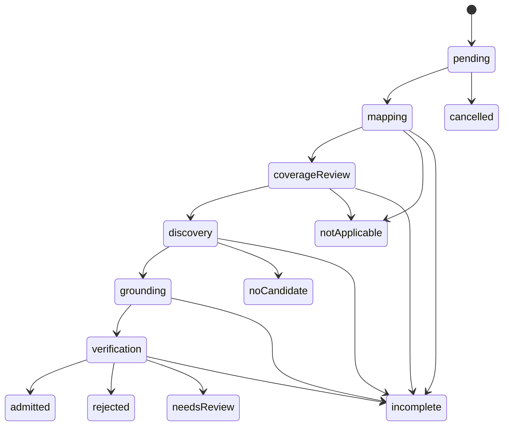

# Durable obligation workflow and lossless recovery

- **Priority:** P0
- **Effort:** XL
- **Risk:** High
- **Status:** Proposed

## Overview

Replace the monolithic vector execution path with a durable, obligation-centric work graph. Every reached phase, provider dispatch, successful tool operation, neutral evidence artifact, candidate, verifier disposition, and terminal closure becomes an idempotent state transition. Provider-signalled context overflow decomposes evidence acquisition into recoverable work units and never promotes a partial leaf judgment.

This is the structural solution to lost context, repeated expensive work, hidden call ceilings, unbounded fan-out, and unrecoverable large scopes. It is not a parser, static vulnerability detector, or second-model workaround.

## Problem statement

- `src/features/audit-execution/audit.ts` combines all phases, retries, checkpointing, candidate fan-out, terminal construction, and error mapping in one large function.
- Late failures zero earlier map/posture counts and observations.
- Evidence-map and posture drafts can be reused before the phase is complete.
- Verification failures/cancellations collapse to generic incomplete.
- `Promise.all` can create hundreds of simultaneous verifier/countercheck calls.
- The app configures infinite iterations, but Harness 1.7.1 clamps one agent loop to 64 steps.
- Context recovery partitions source/context but reducers flatten or select incompatible partial outputs. Cross-file relations and counterevidence can be lost.
- Fixed total array caps make some complete control inventories impossible.
- Attempted/rejected read/grep calls count as inspection.
- Failed provider requests may cost money without a recorded dispatch attempt.

## Proposed solution

### Canonical work graph

Use one deterministic system-owned state machine per enabled plan obligation:

The ledger is append-only and source-free at its state layer. Validated source-derived payloads remain in phase-owned strict artifacts referenced by digest. The model never directly writes orchestration state or chooses a broader scope.

### Work records

Define strict Zod schemas for:

- `AuditWorkIdentity`: run, plan/vector/obligation digests, phase, work-unit ID, scope partition ID, prompt/tool protocol, provider/model/route.
- `AuditWorkState`: pending, claimed, completed, incomplete, failed, cancelled; attempt ordinal; lease owner/expiry; predecessor IDs; timestamps; stable error code; observation reference.
- `PhaseLedgerEntry`: phase/work identity, status, source-free counts, content artifact digest, observation, continuation state.
- `ObligationLedger`: fixed obligation identity plus ordered phase entries and one terminal closure.
- `VectorLedger`: vector identity plus obligation ledgers and derived candidate verification children.

Each transition is append-only/idempotent. The finalizer accepts only the ledger and referenced validated phase artifacts. It never receives positional counts or observations.

### Scheduler and concurrency

- A run-wide scheduler claims ready work under one configurable provider concurrency semaphore. The limit controls simultaneous dispatch only; it does not cap work count/evidence.
- A claimed item has an atomic lease. A pre-existing lease fails closed because portable PID-file stale-owner takeover is not race-free; an operator resolves a known-abandoned lease before recovery resumes.
- Candidates are verified as separate work items. No unbounded `Promise.all`.
- Cancellation stops new claims, propagates the signal to active work, records `cancelled`, and retains completed work.
- Retry policy is phase-aware and provider-neutral. Timeout/cancellation never goes through normal retry. Only explicit unfinished recovery can reattempt terminal stops.
- The system-owned ledger is the task list. Do not mount a writable free-form todo tool into the model sandbox. A read-only progress summary is optional, source-free, and cannot change scope or closure.

### Successful inspection accounting

- Record attempted, completed, rejected, and exhaustive-zero-result tool operations separately.
- A source-deciding completion requires at least one successful `repo_read`/`repo_grep` tied to that work unit when its scope is non-empty.
- A grep over explicit empty paths is invalid. An exhaustive successful grep with zero matches counts as inspecting its declared scope but cannot by itself prove a risk absent; the stage still needs the complete evidence/closure contract.
- Every model-selected evidence record references the successful tool operation (or snapshot projection derived from it), path, and range. A call counter alone is not coverage.
- Any incomplete pagination/continuation referenced by a stage prevents terminal completion.

### Provider-signalled adaptive decomposition

The first attempt always uses the complete approved work scope. Only normalized `context_length_exceeded` starts decomposition.

1. **Evidence collection:** split the source manifest/ranges/context into deterministic partitions. Each leaf returns only neutral facts, controls, unanswered relations, and limitations. Namespace leaf IDs and remap references during canonical union. Same-ID/different-content is rejected.
2. **Coverage/gap review:** operate per obligation over the canonical map. If evidence references still overflow, page references and produce neutral reviewed/unreviewed sets; do not emit a risk verdict per leaf.
3. **Discovery:** split by obligation and evidence relation, not arbitrary source halves. Leaf seeds are unioned only after exact identity/provenance validation. Conflicts remain visible.
4. **Grounding:** split the seed set and map references as necessary. Every seed has exactly one reconciled result. Mixed null/non-null partial views are incomplete until a candidate-specific final reconciliation has seen all required partitions.
5. **Verification:** one candidate per work item. If its referenced evidence overflows, leaf work returns neutral evidence/control assessments; a final verifier decision sees the complete canonical reference inventory. If that final decision cannot fit/reconcile losslessly, mark incomplete.
6. **Context:** retain applicable context in every work lineage and exact line endings. A partition never changes context applicability or drops a document silently.

Do not merge independent security conclusions by majority, first non-null, fixed precedence, or unanimity shortcuts. Recovery may merge neutral facts and explicit state only.

### Paging rather than total caps

- Replace total `.max(...)` limits for vectors, obligations, facts, controls, seeds, candidates, evidence selections, errors, and findings with bounded strict pages linked by deterministic continuations.
- Every page records item count, page digest, predecessor/next identity, and `complete` state.
- A page maximum is a safe transaction/schema limit. The orchestrator automatically continues until complete or explicit stop; it is never reported as complete when more pages exist.
- Aggregate contracts derive total counts from validated pages and reject duplicates/collisions.

### Harness integration

- Confirm whether a current Purista Harness version/API removes the 64-step clamp while preserving normalized errors, sessions, tools, sandbox, telemetry, and provider adapters.
- If upstream supports it, upgrade and add a contract test against the supported public API.
- If a single loop remains capped, make each Harness invocation a bounded durable work quantum; the scheduler starts a new session from strict source-free/phase artifacts. Do not patch `node_modules` or depend on a private bundle line.
- Surface `agent-loop-budget-exceeded` until logical continuation is proven. Never classify it as generic provider failure.

### Usage, cache, and cost

- Continue using provider-side cache routing only; no application prompt/source cache.
- Record `dispatchAttemptCount`, `successfulResponseCount`, known token usage, cached tokens, reasoning/output tokens, duration, and estimated catalogue cost.
- A failed/timeout dispatch has unknown usage/cost unless the provider supplies trusted usage. Aggregate cost becomes `unknown/partial`, never zero.
- On resume, register every exact prior stage observation with the shared cost guard once before new dispatch.
- Cost ceilings block later dispatches only. They do not cancel the crossing request or truncate evidence/work.

## Implementation steps

### Ticket 2.1 — Define the phase/work ledger and finalizer

1. Update reliability, workflow, artifact, cost, and evaluation specs for the work graph and breaking schemas.
2. Create a new `src/features/audit-execution/work-ledger/` feature with strict schemas, reducers, transition guards, finalizer, and colocated tests.
3. Encode every transition as a pure function returning a new validated state/entry; no mutable ad hoc counters.
4. Derive vector/report coverage, closure matrix, errors, funnels, observations, review queue, and terminal state only from the finalizer.
5. Add conservation tests: every approved obligation appears exactly once, every candidate has one verifier terminal lane, every phase count equals referenced artifacts, and no terminal vector contains unfinished work.

### Ticket 2.2 — Add atomic work persistence and scheduler

1. Extend the artifact store with append/compare-and-claim semantics under the run lock.
2. Implement a run-wide ready queue, semaphore, lease, cancellation propagation, and explicit retry selection.
3. Replace vector/candidate `Promise.all` with scheduler work items.
4. Persist after every transition so a process kill can resume from the first unfinished work item.
5. Add deterministic crash/failure injection after every write/dispatch/tool/result boundary and prove completed calls are not repeated.

### Ticket 2.3 — Correct tool accounting and cursor protocols

1. Version tool contracts to add successful/rejected counts, operation IDs, cursor/completeness, and strict non-empty explicit path arrays.
2. Make snapshot list/read/grep page safely and automatically; unify schemas/descriptions at `review-workflow/tools/`.
3. Require stage evidence references to completed operation IDs where source inspection is mandatory.
4. Add tests for malformed reads, empty grep paths, rejected tool handlers, zero-match exhaustive grep, incomplete cursor, cancellation mid-page, and case-insensitive modes.

### Ticket 2.4 — Implement lossless recovery work units

1. Refactor `runtime/context-overflow.ts` to emit deterministic partition work descriptions rather than invoking stage-specific final reducers directly.
2. Implement and test feature-owned neutral reducers for map union, coverage review, seed union, candidate reconciliation, and verification evidence reconciliation.
3. Namespace recovered fact/seed IDs and remap all references; reject collisions and duplicate substitutions.
4. Preserve unanimous source-backed `not-applicable`; mixed/omitted dispositions become incomplete.
5. Add direct production-reducer tests, not only a synthetic generic reducer.

### Ticket 2.5 — Remove cardinality contradictions

1. Inventory every `.max`/fixed array in model, phase, persisted, tool, and report contracts.
2. Classify each as field-safety bound, transaction-page bound, or forbidden total cap.
3. Replace total caps with page contracts and automatic continuation.
4. Add stress fixtures with more than 12 controls, 64 tool rounds, 128 facts, 256 seeds/candidates, large files, many grep matches, and unknown extensions.
5. Assert complete accounting or explicit incomplete stop, never silent omission.

### Ticket 2.6 — Integrate Harness and model-operation semantics

1. Add a Harness compatibility contract test that exposes normalized context overflow, timeout, cancellation, output validation, tool rejection, and loop budget.
2. Upgrade/use the Harness mechanism that supports logical continuation; if unavailable, implement the work-quantum coordinator above the public API and document the upstream limitation.
3. Extend model-operation observations with dispatch attempts and partial/unknown cost.
4. Make cancellation bypass all normal retry/recovery code and preserve exact terminal state.
5. Verify provider shutdown/session closure on success, failure, cancellation, and resumed work.

## Files to modify

- `specs/03-architecture/08-reliable-terminal-coverage-and-resume.md`
- relevant workflow/artifact/security/evaluation specs
- `src/features/audit-execution/audit.ts` (decompose; target under project size guidance)
- new `src/features/audit-execution/work-ledger/**`
- `src/features/audit-execution/coverage-closure/**`
- `src/features/audit-execution/checkpoints.ts`
- `src/features/audit-execution/audit.schema.ts`
- `src/features/review-workflow/runtime/context-overflow.ts`
- `src/features/review-workflow/runtime/invocation.ts`
- `src/features/review-workflow/runtime/source-tools.ts`
- `src/features/review-workflow/stages/**`
- `src/features/review-workflow/tools/**`
- `src/features/model-operations/**`
- `src/platform/harness/security-reviewer-harness.ts`
- `src/platform/artifact-store/**`
- evaluation schemas/runner projections that consume phase state
- colocated tests, generated schemas, agent guidance, and standalone docs

## Acceptance criteria

- Killing the process after any phase/work transition and resuming does not repeat completed model calls or lose reached observations.
- Incomplete map/posture/discovery/grounding/verification drafts are never reused as completed predecessors.
- Cancellation remains `provider-cancelled`/cancelled through stage, vector, report, manifest, evaluation, and exit.
- A rejected or empty-path tool call cannot satisfy inspection.
- More than 64 logical tool/model rounds complete through durable continuation or stop with an explicit resumable state; no generic provider-failure masking.
- More than 12 controls and all other former total caps are carried losslessly through pages.
- Recovered fact IDs cannot collide; missing leaf obligations and mixed grounding outcomes become incomplete.
- Cross-file source/control evidence is retained and the final decision sees the complete referenced basis.
- Run-wide provider concurrency never exceeds configuration, including nested verifier/countercheck work.
- Failed dispatch attempts remain visible and cost is `unknown/partial` when usage is unavailable.
- Full checks pass without live provider calls; one opt-in fake scripted provider exercises every recovery branch.

## Risks and mitigations

- **State-machine complexity:** keep transition schemas/reducers pure and feature-owned; derive all views instead of duplicating state.
- **Artifact volume:** content-address and page; use retention from Wave 5. Do not collapse state to save space.
- **Provider cost growth:** exact resume, one-run diagnostics, concurrency, cache routing, and observed-cost guard control spend without omitting evidence.
- **Recovery semantic drift:** merge neutral evidence only; security conclusions require a final complete-basis decision or remain incomplete.
- **Harness dependency limitation:** test public contracts and keep a durable coordinator boundary so one library loop is not the product's logical work limit.

## Dependencies

- Requires Wave 1's immutable source snapshot, root safety, exact plan identity, checkpoint binding, and run lock.
- Coordinates with Wave 4 prompt/work-unit shapes but can first use current semantics behind new work records.

## Out of scope

- Adding AST/Babel/language-specific vulnerability rules.
- Letting the model write free-form task state.
- Pre-splitting by token estimates.
- Majority voting or mandatory multi-model verification.
- Active exploit reproduction.
