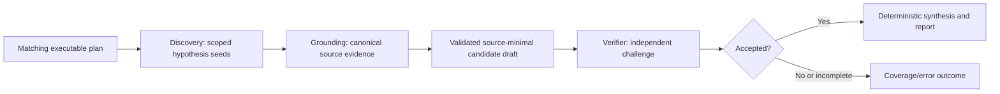

# Language-neutral evidence reasoning and recovery

Status: approved target architecture. This replaces the retired fact/relation and parser experiment. Historical measurements remain in the dated migration record; they are not normative behavior.

## Problem and decision

The earlier route tried to compensate for weak code understanding with lexical clues, parser-local direct-flow relations, and deterministic operation admission. It could neither represent arbitrary languages nor prove the application-level security semantics that matter for authorization, data protection, business logic, or native code. Improving a fixture score by adding another language or pattern special case would not improve the product.

The product therefore uses a language-neutral evidence loop after the human approves a threat plan. Deterministic code provides safety and integrity guarantees. Models perform scope-bounded but cardinality-unbounded semantic reasoning in separate discovery, grounding, and verification responsibilities; no one model response has to manufacture a reportable finding and all canonical evidence bindings at once.

## Production flow

1. `investigation` receives the approved vector, validated map/posture, complete sorted path manifest, separately labelled applicable context, and scoped read-only list/read/search tools. It receives no static candidate catalogue or parser-derived security assertion. It returns small map/posture-bound hypothesis seeds and exact obligation closures—never a reportable finding or claim-role selection.
2. `candidate-grounding` receives only those validated seeds with the same map/posture and scoped tools. It returns either null or a model candidate for every seed. The model candidate contains only its claim statement and initial operation/unsafe-condition map selections; canonicalization derives vector, exact obligations, inherited map basis, posture projection, and limitations once from the seed, then validates any selected additional fact against the seed's approved obligations. Grounding cannot create a seed, widen scope, or use evaluation data.
3. Deterministic integrity validation checks only pairing, vector/obligation identity, approved scope, file/path/line existence, closed schema shape, and source-minimal evidence-reference projection. A reference records kind, role, range, and the SHA-256 digest of the exact selected source line; it never stores the line itself. The model selects only a physical line returned by `repo_read`; deterministic code validates that provenance but never classifies source text, infers a relationship, or ranks a claim.
4. Only validated grounded candidates form a phase-bound successor draft. They may retain only their validated/redacted `ClaimNarrative` beside source-minimal evidence references; the narrative is not source content, a transcript, evidence, identity, or an admission input. The draft can be atomically checkpointed outside the target without prompt, raw discovery/grounding output, source content, tool transcript, provider id, or secret.
5. `verification` receives one hypothesis at a time and the same vector-scoped tools. It independently re-reads every selected `repo_read` line and relevant mapped control, actively seeks source-local controls that could negate the claimed path, and returns exactly `accepted`, `rejected`, or `incomplete`. An accepted result establishes every condition and protected security consequence in the obligation's exact `riskStatement`; a generic missing guard, adjacent risky-looking pattern, or source-visible behavior without that consequence is `incomplete` with `context-required`. An accepted model output preserves the hypothesis's exact role-labelled `operation` and `unsafe-condition` map selections and selects control and candidate-relevant source-posture evidence from the bounded neutral map. It must also state exactly one `supports-claim`, `contradicts-claim`, or `unresolved` reconciliation for every exact human-approved plan obligation referenced by the hypothesis, selecting evidence only from map facts bound to that same obligation. `unresolved` cannot accompany an accepted decision. The model assesses the smallest static claim tuple relevant to each obligation—trigger/boundary when applicable, control, effecting operation or unsafe condition, counterevidence, and proof gap—without a fixed taxonomy or language rule. Deterministic code projects the reconciled evidence set, exact obligations, required control-fact coverage, obligation-reconciliation coverage, and posture-reconciliation coverage. It cannot introduce a different risk, vector, classification, urgency judgment, remediation, or source location. These checks prove full provenance and declared semantic disposition only; they do not decide source flow, vulnerability semantics, or control effectiveness. Absence of an evidence reference is never proof of a bypass.
6. A deterministic state machine retains only `accepted` hypotheses whose verifier-reconciled source integrity remains valid. Rejected/incomplete hypotheses become explicit coverage/rejection outcomes. Duplicate collapse remains deterministic post-processing and never proves exploitability or a relationship between findings.

## Boundaries

| Owner | Owns | Must not own |
| --- | --- | --- |
| `review-workflow/agents/planning` | Draft threat-plan contract/instructions | Plan approval or target mutation |
| `review-workflow/agents/investigation` | Hypothesis contract/instructions | Finding admission or verifier decision |
| `review-workflow/agents/verification` | Verdict contract/instructions | New findings, altered evidence, classification/urgency/remediation decision |
| `audit-execution/investigation` | Scope, path manifest, evidence integrity, source-minimal draft | Security semantics from text patterns |
| `audit-execution/verification` | Verdict binding, acceptance state, phase retry | Repository-wide access or synthesis |
| `audit-execution/checkpoints` | Phase-bound validated source-minimal recovery artifacts | Raw model/tool/source persistence |
| `audit-execution/synthesis` | Stable duplicate collapse and accepted/needs-review report-item projection | Semantic interpretation, cross-finding relationship, or exploit proof |
| `model-operations` | Per-stage/per-request numeric ledger | Prompt/source/tool/model content |

## Language-neutrality invariants

- Every bounded UTF-8 regular source file remains eligible for inventory, scoped read, search, investigator reasoning, verifier reasoning, and report evidence, even with an unknown extension or null language hint.
- A regex, API name, language hint, extension, parser result, AST node, fixture, corpus answer key, or benchmark-specific condition cannot establish a security operation, unsafe condition, data flow, classification, urgency, or persisted claim.
- No parser or AST adapter participates in the production finding path. A future syntax component requires a new specification that confines it to reusable multi-language navigation/enrichment and prohibits any effect on scope, planning, finding admission, classification, urgency, or conclusion.
- Evaluation fixtures, corpus provenance, answer keys, scores, and baselines are evaluator-only. They cannot be read by agents and cannot generate product rules or prompt exceptions.

## Recovery and observations

The canonical candidate-grounding draft and each terminal vector result are independently checkpointable. Discovery seeds are not persisted. The grounding draft includes one canonical disposition per seed, the closed discovery-to-grounding funnel, canonical-candidate rejection ledger, and required discovery/grounding stage observations alongside closures. A resumed verifier derives only grounded candidates from those same canonical outcomes and projects the exact source-free values into the terminal result; it must not recreate a second candidate list, recompute saved funnels, or omit costs. Reuse requires run id, approved plan id, target fingerprint, provider, model, vector id, phase, and the grounding protocol fingerprint to match. A completed grounding draft may be reused after a verifier failure; a verifier retry does not repeat discovery or grounding. A changed target, plan, provider/model, vector, or protocol invalidates reuse.

Planning, investigation, and verification are separate model stages. Each stores only stage/status/id, stable error code, duration, per-response input/output/cached/reasoning tokens, cost state, cache-routing flag, and aggregate tool counts/bytes/rejections. The run aggregate is derived from those observations. A provider-backed reusable stage artifact requires its matching observation; recovery artifacts use the closed `execution.kind` union so deterministic no-provider children are explicit. No stage ledger, checkpoint, log, or report stores prompts, source text, raw model output, tool arguments/results, provider request ids, or credentials. The sole structured exception is a canonical candidate/report `ClaimNarrative`, which is validated/redacted human-facing context rather than raw output or an operational ledger field.

## Acceptance and anti-drift checks

- Unknown-extension and mixed-language fixtures prove that neither investigation nor verification is skipped or rejected on language metadata.
- A fake investigator/verifier test proves a valid hypothesis is not persisted without verifier acceptance.
- A verifier cannot add a different finding, change vector/classification/urgency, or inspect outside the vector scope; an accepted verdict reconciles complete operation and unsafe-condition evidence bundles from the same scoped source.
- A failed verifier can resume from a matching candidate-grounding draft without rerunning discovery or grounding, while preserving their exact source-free funnels, rejection ledger, observations, and derived run cost; a mismatched or historical draft fails closed.
- Token, cost, latency, cache-routing, tool-usage, and failures appear independently for investigation and verification and sum exactly into the run ledger.
- Tests fail if the production audit imports a parser, structural adapter, static security rule catalogue, evaluation answer key, or fact/relation admission module.
- Evaluations measure the resulting behavior against declared corpus versions and never alter rules, prompts, thresholds, or claim semantics automatically.
