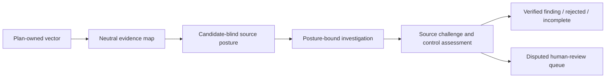

# Candidate-blind source posture

Status: implementation refactor authorized by the product owner after `reviewed-plan-same-route-claim-path-20260730` completed all 30 provider trials but admitted every structurally valid candidate, including six patched false positives. This replaces an anchored claim-first verification dependency with a candidate-blind source assessment. It is not an alternate-model route, static rule, parser, language feature, benchmark adjustment, or answer-key-derived policy.

## Problem and decision

The evidence map establishes neutral provenance, but the verifier starts with an investigator hypothesis. The fresh baseline showed that the same-route verifier accepted all 25 structurally valid candidates, including all six false positives on patched variants. An additional countercheck experiment had previously failed to improve the pattern and remains evaluation-only. The root design change is therefore to make the first semantic assessment of each vector question **before** a candidate exists.



`source-posture` is a new primary-route product phase. It runs in a new session and receives only the approved vector, validated map, scoped path manifest, separately labelled applicable context, and the same scoped read-only tools as later phases. It must not receive an investigator candidate, claim statement, classification, urgency, impact, proposed fix, verifier/countercheck output, answer key, paired variant, or any model-generated claim text. Tool calls remain inside the vector scope and share no source access with other vectors.

## Capability contract

| ID | Actor | Trigger | Preconditions | Final state | Owner | Verification |
| --- | --- | --- | --- | --- | --- | --- |
| CAP-067 | Source-posture assessor | Validated evidence map for one enabled plan vector | Exact matching plan, scoped sources, validated map | One validated posture assessment per plan review obligation, or explicit failed/incomplete coverage | `audit-execution/source-posture`, `review-workflow/agents/source-posture`, `review-workflow/stages/source-posture` | Blind-input, closed-schema, source/map binding, tool-use, recovery, telemetry, unknown-language, privacy, and provider-evaluation tests. |

## Strict contract and admission semantics

`source-posture` owns these strict Zod schemas and their inferred types:

- `SourcePostureAssessmentSchema`: `assessmentId`; one canonical `obligationId`; canonical conclusion `risk-supported`, `risk-contradicted`, `inconclusive`, or `not-applicable`; one or more included evidence-map fact identifiers; bounded limitations; and a required crisp `notApplicableReason` exactly when the conclusion is `not-applicable`.
- `SourcePostureSchema`: bounded assessments and vector-level limitations. Assessment identifiers and obligation ids are unique.
- `UnverifiedSourcePostureSchema`: derives from the persisted schema and weakens only model identifier/cardinality constraints necessary to retain visible model-output failures for deterministic filtering.

`not-applicable` is a source-backed neutral closure for a business-level plan obligation that does not apply to this repository. It requires a crisp reason. It is neither a finding nor a passed check, and it is not an incomplete result when the scoped source inspection completed.

The admission boundary validates that the persisted posture has exactly one assessment for every approved obligation; every cited fact exists in the validated map and has that obligation; all cited map evidence is already inside the vector scope; and all canonical enum tokens have one shared normalization path. A mapper or posture assessor may state `inconclusive`; this is visible incomplete coverage, never a clean result.

Conclusion values are **model judgments about the approved risk-positive obligation**, not deterministic security labels. Deterministic code may validate their schema, completeness, map membership, obligation binding, scope, source-line integrity, redaction, and phase identity. It must never infer `risk-supported` or `risk-contradicted` from a language, parser, lexical pattern, API, fixture, answer key, source text, or absent code.

The investigation candidate and admitted hypothesis both require non-empty `sourcePostureAssessmentIds`, using the posture-owned identifier representation. Discovery and grounding models do not author those identifiers: the source-posture owner deterministically projects every assessment for the exact approved obligations, together with its pre-existing map-fact identifiers. For every plan obligation referenced by the hypothesis, admission therefore requires at least one projected posture assessment for that obligation. A candidate-aware stage may add evidence after an `inconclusive` posture. If a structurally accepted candidate-aware result conflicts with a candidate-blind `risk-contradicted` posture over the same scoped evidence, deterministic code routes the redacted item to `reviewRequired`; it does not promote it to a confirmed finding, chain, or CI severity decision. This is an independence/disagreement signal over prior source-scoped model judgments, not a language, parser, source-text, benchmark, or answer-key rule. A `risk-supported` posture is not a positive finding shortcut. A directional posture conclusion without a scoped read or search is deterministically downgraded to `inconclusive` with a visible limitation; it does not terminate the vector, because the later discovery and verifier stages must inspect approved source independently. This does not prove the candidate, data flow, exploitability, urgency, or control effectiveness.

The verifier continues to decide the individual hypothesis from fresh source inspection. It receives the posture only as labelled pre-existing evidence and must reconcile it rather than treat any conclusion as a shortcut. For an accepted result it emits exactly one reconciliation for every posture assessment relevant to the hypothesis obligations and exactly one separate reconciliation for every exact approved obligation. Each reconciliation declares the model's relation to the claim as `supports-claim`, `contradicts-claim`, or `unresolved`, selects one or more evidence locations only from the corresponding posture assessment's map facts or, for an obligation, a map fact bound to that exact obligation, and gives bounded explanatory text. An accepted result cannot declare any reconciliation `unresolved`; a `contradicts-claim` declaration remains a visible model judgment and is not deterministically reinterpreted as a security verdict. An accepted result also preserves the complete exact plan-obligation set and explicitly lists every validated evidence-map `control` fact sharing those obligations. Deterministic code checks assessment identity, complete obligation coverage, selected-map provenance, and declared unresolved state; it never decides whether a posture, control, data flow, or hypothesis is semantically correct.

## Recovery, telemetry, and report lifecycle

With a non-empty scoped manifest, posture must inspect scoped source with `repo_read` or `repo_grep` before returning any assessment; listing files alone is insufficient. The shared lifecycle retries an uninspected completion only within that exact scope under the configured normal retry policy, then records explicit incomplete coverage if no inspected completion is available. A directional `risk-contradicted` assessment requires source-visible counterevidence that directly negates its exact approved obligation. A declaration, identifier, parameter, lookup, wrapper, comment, or nearby API call is not effective counterevidence by itself. This remains a model judgment: deterministic code checks only the inspection observation and existing map/obligation provenance; it never determines whether a control is effective.

Source posture is checkpointed after evidence mapping and before discovery. A posture draft binds run id, plan id, target fingerprint, primary provider/model, verification-route fingerprint, evidence-map protocol fingerprint, vector id, and phase. It is reusable only when every binding matches and only for retrying discovery, grounding, or verification. A matching map draft may retry posture; a matching posture draft may retry discovery; a canonical candidate-grounding draft may retry verification; terminal results remain reusable under their existing exact binding. New report/checkpoint versions reject legacy artifacts rather than silently treating them as posture-bound.

`model-operations` adds the canonical `source-posture` stage. It has its own provider-retry policy, source-free request ledger, usage, pricing, latency, and terminal status. Vector coverage adds `risk-supported`, `risk-contradicted`, and inconclusive assessment counts plus the optional posture observation. The report exposes counts, limitations, and source-free operational data only; it never stores raw model output, prompts, tool data, credentials, or provider request IDs.

## Structure and reuse

```text
src/features/
  audit-execution/
    evidence-map/
    source-posture/{contract,verify}/
    investigation/{evidence-package,verify}/
    checkpoints/
  review-workflow/
    agents/source-posture/{contract,instructions}/
    stages/source-posture/
    stages/scoped-model-stage/
```

`source-posture/contract` owns posture-specific schemas and conclusion values. It reuses the canonical plan-obligation identity, source-evidence definitions, model-token normalizer, evidence-map fact contract, scoped model-stage lifecycle, source tools, and redaction logic. It must not copy any of those schemas, types, enum declarations, token normalization, or source validation. `audit-execution/audit.schema` owns persisted draft/coverage/report projections; `checkpoints` owns paths, creation, and reuse; `review-workflow` owns model contracts, instructions, stage invocation, and harness mounting. No feature moves into `shared/` unless a second feature needs the exact same invariant.

## Evaluation and promotion

The first posture measurement uses the unchanged `security-reviewer-real-world-seed@0.2.1` development split, reviewed-plan profile, `openai/gpt-5.3-codex`, same-route verification, the scoped repository-tool protocol, one vector at a time, default retry, existing execution budget, and five repeats. It records a new prompt protocol fingerprint, so strict comparison with the pre-posture run is intentionally rejected; the report presents a descriptive side-by-side evidence summary instead.

Promotion is prohibited unless a qualified repository-disjoint corpus and private holdout show no safety regression, no vulnerable minimum-recall regression, and a preregistered precision/recall/cost decision. The current seed has zero dual-reviewed real-world pairs and therefore remains diagnostic only. A result that improves one case, one language, aggregate median, or only contract integrity is not evidence of production reliability. Do not add a source-specific condition, static detector, parser, language path, answer-key field, or paired-variant signal in response to a result.

## Acceptance

1. Source posture receives no candidate or verdict-derived content, and its input schema/harness workflow prove that boundary.
2. Every enabled vector gets exactly one validated posture assessment per approved review obligation before investigation, or visible incomplete/failed coverage with no finding.
3. A candidate cannot reach verification unless all of its referenced obligations bind to cited posture assessments and their cited map facts; a structurally accepted candidate-aware result that conflicts with a relevant candidate-blind `risk-contradicted` posture enters the redacted non-gating human-review queue, not confirmed findings.
4. Every posture assessment must cite every validated mapped `control` fact for its exact obligation before it can retain a directional conclusion. An accepted verifier result cannot persist unless it explicitly covers every exact hypothesis obligation, validated mapped control fact, and candidate-relevant posture assessment relevant to the hypothesis obligations; an unresolved obligation or posture reconciliation yields an incomplete terminal result.
5. All posture evidence, tools, checkpoints, and report coverage remain vector-scoped, redacted, content-free outside validated report evidence, and language neutral.
6. Map, posture, investigation, verification, and terminal phases independently resume under exact matching bindings without repeated completed provider work.
7. Contract, failure, recovery, privacy, unknown-language, telemetry, report, fake-provider, and full local checks pass before the opt-in five-repeat provider measurement.
8. The provider result is reported as a diagnostic measurement unless the separately defined qualified-corpus and private-holdout promotion conditions are met.

## Checklist walk

```yaml
checklist_walk:
  status: covered
  topics:
    architecture_structure:
      applicability: relevant
      evidence: ["Structure and reuse"]
    contracts_generation:
      applicability: relevant
      evidence: ["Strict contract and admission semantics"]
    testing_verification:
      applicability: relevant
      evidence: ["Acceptance"]
    security_abuse:
      applicability: relevant
      evidence: ["Problem and decision", "Strict contract and admission semantics"]
    data_persistence:
      applicability: relevant
      evidence: ["Recovery, telemetry, and report lifecycle"]
    async_integrations:
      applicability: relevant
      evidence: ["Recovery, telemetry, and report lifecycle"]
    ai_ml_automation:
      applicability: relevant
      evidence: ["Evaluation and promotion"]
    performance_capacity:
      applicability: relevant
      evidence: ["Recovery, telemetry, and report lifecycle", "Evaluation and promotion"]
    frontend:
      applicability: not_applicable
      evidence: ["CLI-only product; no browser UI in v1"]
  blocking_findings_count: 0
```
