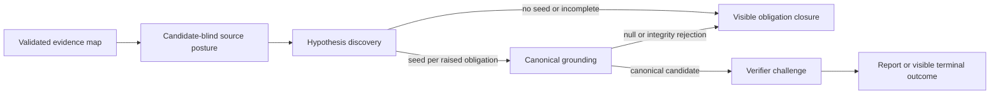

# Hypothesis discovery and canonical grounding

Status: approved target architecture. CAP-072 through CAP-074 replace the candidate-repair successor as the production path. This is a measured protocol repair, not a language, corpus, parser, or model-route exception.

## Evidence and decision

The five-repeat `baseline-closure-reviewed-20260730` provider measurement completed every trial but found 7 of 20 expected vulnerable findings, admitted 5 non-vulnerable findings, and structurally rejected 8 of 20 model candidates. The failure was not provider availability, target-language coverage, or plan approval: it occurred where one investigator response had to make a security judgment, carry every closure, emit a full finding, cite all map/posture references, and satisfy canonical evidence/claim-path shape simultaneously. The existing identity-preserving repair can only correct a fully formed candidate and cannot reduce that overloaded first handoff.

The first evidence-first measurement removed the premature model-authored claim path, but its five-repeat same-route run still found only 3 of 20 expected vulnerable findings, produced 3 patched/benign findings, and rejected 8 of 17 seeds during deterministic trace attachment. Moving identifier selection into discovery improved detection to 6 of 20. The grounding-owned alternative was then rejected by a controlled five-repeat run: it preserved identity but structurally rejected every non-null grounded candidate. A separate 30-trial negative control isolated the loss to the synthetic structural-trace check: there were zero identity rejections, 16 trace rejections, no submitted candidate, and no finding. That check was neither source evidence nor a security proof, so CAP-074 removes it entirely rather than relocating it. Map/posture bindings and verifier-inspected source evidence remain mandatory.

The production path therefore separates two different model responsibilities:

1. **Hypothesis discovery** decides whether scoped mapped/posture evidence warrants a review hypothesis for each approved obligation. It produces a small, non-reportable seed or an explicit closure. A seed is not a finding and contains no classification, urgency, impact, remediation, source snippet, source-flow assertion, model-authored posture identifier, or claim-role selection. Its bounded neutral-map fact references are a source-inspected hypothesis basis only. The posture owner derives the exact posture references from approved obligations.
2. **Canonical grounding** receives only discovery seeds for the same vector together with the validated map, posture, scoped path manifest, advisory context, and read-only tools. It returns exactly one explicit disposition per seed: `grounded` with one model candidate, `no-source-backed-candidate` when scoped inspection does not establish the seed, or `map-insufficient` when the neutral map lacks a required relation. `map-insufficient` carries one-or-more approved-obligation-bound closed generic needs and opens candidate-blind map repair; it cannot be represented as an unexplained null. The model candidate contains only a precise statement and exactly one `operation` plus one `unsafe-condition` selection bundle. It independently re-inspects source and owns the first role selections. Canonical materialization—not the model—copies the seed's vector, obligations, inherited map references, posture projection, and limitations, then derives the complete map basis from inherited references plus the selected facts. It accepts an added fact only when that validated fact binds one of the seed's exact approved obligations and projects every selected source-evidence item into the canonical `ClaimNarrative`. A selection may serve both roles when the model independently explains both roles. The model may not create a seed, vector, classification, urgency, impact, remediation, scope, source path, line, snippet, evidence role, or posture identifier. It never emits or depends on a synthetic trace pointer.
3. **Verification** remains the source-scoped falsifier for each canonical candidate. It receives the exact canonical narrative as claim context, but independently rereads scoped source and cannot treat that narrative as evidence, provenance, or proof. It may accept, reject, or mark incomplete; it cannot create a candidate or widen scope. An accepted decision preserves every canonical operation/unsafe-condition map selection under its same role while independently reconciling controls and posture.

The existing candidate-repair stage is retired from production behavior. Historical candidate-repair artifacts remain incompatible rather than silently being read as discovery or grounding state.

## Flow and ownership

| Owner | Owns | Must not own |
| --- | --- | --- |
| `audit-execution/investigation` | Discovery seed, per-obligation closure, seed/map/posture binding | Presentation, classification, urgency, remediation, or admission |
| `audit-execution/candidate-grounding` | Seed-to-candidate pairing and canonical grounding contract | New seeds, security rules, scope expansion, or verifier verdict |
| `audit-execution/investigation/verify` | Canonical source/map/posture integrity validation | Security semantics, dataflow, or control-effectiveness inference |
| `audit-execution/investigation/agent` | Small discovery input/output and instructions | Grounding or verifier decision |
| `audit-execution/candidate-grounding/agent` | Full candidate grounding input/output and instructions | New hypothesis discovery or report admission |
| `audit-execution/admission` | Source-free count conservation and terminal attrition reasons | Source/model content or security meaning |
| `evaluation` | Source-free per-trial diagnostic aggregation | Target/answer-key/model-content persistence |

## Contracts and safety invariants

- A discovery seed has one stable seed id, its exact vector id, one or more approved plan-obligation references, non-empty selected map references, a bounded neutral hypothesis statement, and limitations. Its map references must bind its exact approved obligations. The posture owner derives the non-empty posture references and included map facts for those obligations before grounding. A `candidate-raised` closure requires at least one valid seed for the same obligation; `no-source-backed-candidate` requires none; `incomplete` remains visible.
- A grounding request contains only the approved vector, validated map, validated posture, validated seeds, the same vector-scoped source-path manifest, labelled applicable context, and scoped read-only tools. It contains no answer key, benchmark label, paired variant, verifier outcome, prior report, broader target view, or dynamic capability.
- A grounding result contains exactly one entry for every requested seed. Every raw entry has a required `nullReason`: it is exactly `null` when the entry has a complete model-facing candidate, and exactly one closed null-reason token (`no-source-backed-candidate` or `map-insufficient`) when `candidate` is `null`. A `map-insufficient` result additionally requires generic obligation-bound map insufficiencies. A non-null model candidate contains only statement and two role-selection bundles; it cannot repeat or author seed-owned vector, obligation, map-basis, posture, or limitation fields. Canonical materialization carries those seed bindings and derives its map basis from every inherited reference plus the model's selected facts. It accepts an added fact only when the validated fact binds one of the seed's exact approved obligations. Grounding independently selects exactly one `operation` and one `unsafe-condition` evidence bundle from that validated same-obligation map basis. This binds an initial claim to its neutral evidence basis without interpreting fact roles or source semantics. The verifier independently reads scoped source for its decision, but an accepted result preserves that lineage and selects its operation, unsafe-condition, and control evidence from the same map artifact; code projects the exact obligations and relevant control identifiers. Deterministic code does not infer a vulnerability, data flow, relationship, control effectiveness, or priority.
- Grounding runs once per vector execution, has the normal provider-retry policy, and shares no tools or state with earlier sessions. It is not a retry loop, a fallback detector, or a second model route.
- Only canonical grounded hypotheses, validated closures, closed source-free grounding funnels/rejection counts, and content-free discovery/grounding observations may be checkpointed for verifier retry. A canonical hypothesis may retain only its validated, artifact-text-redacted `ClaimNarrative`; it is not raw model output, source text, a source excerpt, a verifier rationale, or an admission input. Discovery seeds, raw discovery output, raw grounding output, prompts, source text, tool arguments/results, provider ids, and credentials are never artifacts. A resumed verifier carries the saved funnels, observations, and exact canonical narrative to terminal coverage rather than deriving replacement values from the saved hypotheses. Map/posture recovery remains reusable; interruption before canonical grounding resumes from the latest safe predecessor.
- Every new stage records its own content-free request/stage observation. The prompt protocol fingerprint changes whenever discovery/grounding instructions or tool descriptions change. Old investigation/repair checkpoints and report versions are rejected rather than reinterpreted.
- Every bounded UTF-8 regular source file remains eligible regardless of extension or language hint. No AST, parser, lexical pattern, dataset item, answer key, expected location, or language rule can create a seed, candidate, classification, urgency, or conclusion.

## Diagnostic continuity

Evaluation trials retain a strict, source-free attrition ledger. It contains only numeric counts and closed tokens: discovered seeds, discovery-binding rejections partitioned by the closed seed-structural-reason enum, grounding-null results, grounding-binding rejections, canonical integrity rejections by stable structural-reason token, verifier accepted/rejected/incomplete outcomes, and terminal admitted count. It contains no source path, source text, hypothesis title/summary, finding key, prompt, model output, tool argument/result, credential, answer key, or score-derived reason.

The audit report may retain its existing human finding content, but its coverage and evaluation projections use only this ledger to explain phase loss. Aggregate counters must conserve: discovered seeds equal discovery-binding rejections plus grounding-null outcomes plus grounding-binding rejections plus submitted candidates; submitted candidates equal structural/tool rejections plus verifier terminal outcomes; reconciled verifier outcomes equal post-verification rejections plus admitted findings. A failed or legacy trial marks diagnostics unavailable rather than zero.

Every discovery and canonical structural rejection is also counted under its single-owned closed reason enum. The report and evaluation may aggregate only these category counts; they must not retain a candidate, seed, location, map id, source text, prompt, model output, or reason prose. This diagnostic identifies a failing contract boundary without creating a security rule or a benchmark-specific exception.

## Acceptance

- A fake workflow proves discovery cannot emit a reportable finding and grounding cannot create a seed or change vector/obligation identity.
- Missing/duplicate discovery closures or seed identifiers, invalid map/posture bindings, grounding omission/duplication, vector mismatch, scope expansion, absent source access, and non-canonical candidates fail closed with visible coverage/diagnostic outcomes.
- A resume reuses only map/posture/canonical grounded successor bindings; no raw seed/output is persisted or reused.
- Harness, schema, privacy, unknown-language, source-scope, recovery, retry, report, and evaluation tests prove the stage is language-neutral and read-only.
- A newly fingerprinted reviewed-plan provider evaluation with its explicit repeat count is recorded descriptively after local checks. It must report detection, false-positive availability, attrition, completion, cost, tokens, and latency; it must not auto-promote a baseline or alter behavior from answer keys.
