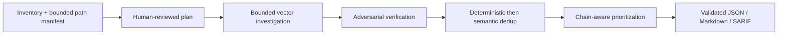

# Upstream implementation analysis

Research date: 2026-07-27. Repositories reviewed at the checked-out revisions recorded below. This file records implementation patterns, not a promise to copy either project.

| Project | Revision reviewed | Useful pattern | Deliberate decision here |
| --- | --- | --- | --- |
| Visa Vulnerability Agentic Harness | `d91b28d` | Eleven staged phases: preprocess, threat model, decompose, deep dive, prefilter, verify, dedup, chain, report, remediate, validate. | Adopt stages 1–9 conceptually; v1 stops at report and never edits or executes the target. |
| Visa Vulnerability Agentic Harness | `d91b28d` | Pydantic models, redaction, deterministic prefilters, adversarial verification, semantic deduplication, chain analysis, SARIF/report projections, run metrics. | Reproduce the boundaries with strict Zod, trusted deterministic rules, bounded evidence, and optional SARIF projection. |
| Visa Vulnerability Agentic Harness | `d91b28d` | JSON-validated checkpoints replaced unsafe pickle, with size limits and rerun-on-invalid behavior. | v1 has file artifacts and atomic writes; if resumability is added, checkpoints must be inert JSON validated before use. |
| Vercel Deepsec | `76c03d6` | Matcher registry performs cheap discovery before expensive AI processing. | Retain bounded inventory and resumable artifact ideas, but reject matcher-derived security candidates: they would make narrow language/pattern coverage determine the review path. |
| Vercel Deepsec | `76c03d6` | One-file records, append-only analysis history, stable finding ids, per-file locking, revalidation, and export stages. | Adopt stable ids, immutable run manifests, explicit coverage, and repeat-safe report generation; defer long-lived cache/parallel workers. |
| Vercel Deepsec | `76c03d6` | Project `INFO.md`, plugin extension points, shell-capable agents, sandbox/remote executor. | Adopt short explicit context files; reject shell, executor, remote network, mutable plugins, and target-side instructions in v1. |
| Local CodeReviewer | current local checkout inspected 2026-07-29 | Domain-owned agent/workflow folders, provider usage recorder, priced token aggregation, route-aware workflow boundaries, and bounded refutation. | Reuse the ownership and source-free per-call accounting discipline already implemented here. Do not adopt its parser/deterministic-signal candidate path; CAP-063 instead specifies a language-neutral, separately routed verifier experiment. |

## Observed architecture lessons

1. Deterministic inventory, limits, and file identity make runs safer and explainable. The model stages, not matchers, perform security reasoning from a bounded vector path manifest; deterministic code must not rank or exclude a source file on a security-pattern guess.
2. A finding needs more than a title: source location, source/sink or control reasoning, confidence, severity rationale, related locations, and an explicit revalidation outcome are required for useful triage.
3. Multiple independent findings need deterministic deduplication before semantic deduplication. Semantic deduplication must define “one fix closes both” and retain related locations.
4. A final report should distinguish no findings, unverified findings, verification failures, incomplete coverage, and degraded ranking. A provider error must not silently become a clean result.
5. Append-only history and run metadata improve retryability, but untrusted state must be inert JSON, bounded, schema-validated, and safely ignored when invalid.
6. Extension points are valuable only when they are explicit contracts. A v1 static scanner must not accidentally reintroduce network, arbitrary execution, or source mutation through an extension mechanism.

## Adopted stage graph

The graph is a product contract, not a requirement to create one source file per stage. Each stage is a feature-owned use case with a typed input/output and colocated tests.

## Rejected or deferred patterns

Shell tools, target execution, source mutation, remote ownership APIs, remote executors, arbitrary plugins, dynamic package loading, live CVE enrichment, and network-based verification are excluded from v1 because they expand the trust boundary beyond a CI-safe static review. They may be introduced only as separately specified adapters with explicit policy, approval, sandbox, and evaluation evidence.
