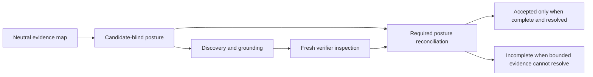

# Verifier posture reconciliation

Status: implementation refactor authorized by the product owner after the five-repeat `verifier-selected-evidence-reviewed-20260730` diagnostic completed 30 trials. The measurement removed verifier evidence-materialization loss (zero verifier-evidence rejections) but still failed its reliability gate with 12 vulnerable false negatives and four patched/benign false positives. It is a language-neutral process repair, not a detector, parser, prompt-only tweak, model-route substitution, corpus exception, or answer-key-derived rule.

## Problem and decision

Candidate-blind source posture exists before discovery so that a candidate does not become the first semantic frame. The verifier instruction said to reconcile this posture, but its prior output contract did not require an explicit record. An accepted result could therefore carry map-selected operation and control evidence while silently omitting a posture assessment that was relevant to the same approved obligation.

CAP-074 makes that reconciliation an accepted-verdict contract. The verifier still performs the security reasoning from fresh, scoped static source inspection. It now declares its relation to every candidate-relevant posture assessment and selects its supporting source locations from that assessment's existing neutral-map facts. Deterministic code verifies only the complete set, identifiers, selected-map provenance, and declared unresolved state. It never decides whether a posture, a control, or a hypothesis is correct.



## Contract

`audit-execution/verification/contract` single-owns these strict Zod schemas and inferred types:

- `ClaimReconciliationDispositionSchema`: normalized `supports-claim`, `contradicts-claim`, or `unresolved`; posture reconciliation reuses this single declaration directly.
- `SourcePostureReconciliationSchema`: canonical posture assessment id, disposition, bounded explanation, and source-backed canonical evidence.
- `UnverifiedSourcePostureReconciliationSchema`: model-facing counterpart that selects the evidence only as `{ factId, evidenceIndex }`.

An accepted `UnverifiedAuditVerificationResult` includes a non-empty reconciliation list and cannot contain `unresolved`. The materializer receives the validated source posture alongside the map and hypothesis. It derives every required assessment from the hypothesis's plan obligations, requires exactly one reconciliation for each, and accepts an evidence selection only when it belongs to that assessment's own map facts. It projects canonical source evidence with an explanatory role. Rejected and incomplete results persist an empty list.

The ordinary audit-port path performs the same exact-set and source-location-overlap validation on canonical verifier and countercheck results. It must reject a result that is missing, duplicates, expands, leaves unresolved, or cannot source-bind a required reconciliation. It may not infer the semantic meaning of any disposition.

## Scope, recovery, and observability

The change adds no source access, target mutation, network capability, provider, parser, static detector, datastore, checkpoint, report version, or new persisted raw model data. Reconciliation is part of the terminal verification result already checkpointed under its existing exact binding. A changed verifier contract/instruction changes the existing protocol fingerprint, so an older terminal result is not reused.

The report may render canonical reconciliations only as part of already admitted, redacted finding evidence. Source-free telemetry and evaluation artifacts retain aggregate stage/funnel data only; they never retain raw posture output, source text, prompts, tool arguments/results, or answer-key content.

## Acceptance and measurement

1. Accepted model output must provide a non-unresolved reconciliation for every posture assessment whose question is used by the candidate.
2. No reconciliation can author a source location; every evidence selection must be an in-range item of that assessment's mapped fact.
3. Canonical and direct audit ports both reject incomplete, duplicate, extraneous, unresolved, or source-unbound reconciliation coverage without making a semantic determination.
4. Countercheck preserves the same boundary and cannot bypass it.
5. All contract, materializer, harness, audit-port, recovery, privacy, unknown-language, and full local checks pass.
6. A five-repeat provider evaluation uses the unchanged corpus, reviewed plan profile, same model route, tool-assisted evidence, and budget. It reports aggregate recall, patched/benign false positives, stage attrition, cost, latency, tokens, and cache routing. It is diagnostic only; no benchmark-specific behavior is introduced.
7. Only after this measurement, a pre-registered frozen-protocol cross-model comparison may determine whether a model change is justified. The experiment fixes `audit-real-world-seed@0.2.1`, `development`, reviewed-plan, tool-assisted evidence, one vector at a time, the existing timeout/retry budget, same-route verification, and the unchanged posture-reconciliation prompt fingerprint; its selected repeat count is recorded configuration, not a product requirement. Its baseline is `openai/gpt-5.3-codex` run `verifier-posture-reconciliation-reviewed-20260730`; its challenger is `openai/gpt-5.6-terra` as the sole primary and verifier route. The comparison uses `primary-model-experiment`, which rejects every difference except that single route. A different model is not admitted to product behavior merely because it performs better on this seed.

## Checklist walk

```yaml
checklist_walk:
  status: covered
  topics:
    architecture_structure:
      applicability: relevant
      evidence: ["Contract", "Scope, recovery, and observability"]
    contracts_generation:
      applicability: relevant
      evidence: ["Contract"]
    testing_verification:
      applicability: relevant
      evidence: ["Acceptance and measurement"]
    security_abuse:
      applicability: relevant
      evidence: ["Problem and decision", "Contract"]
    data_persistence:
      applicability: relevant
      evidence: ["Scope, recovery, and observability"]
    async_integrations:
      applicability: relevant
      evidence: ["Scope, recovery, and observability"]
    ai_ml_automation:
      applicability: relevant
      evidence: ["Acceptance and measurement"]
    performance_capacity:
      applicability: relevant
      evidence: ["Acceptance and measurement"]
    frontend:
      applicability: not_applicable
      evidence: ["CLI-only product; no browser UI in v1"]
  blocking_findings_count: 0
```
